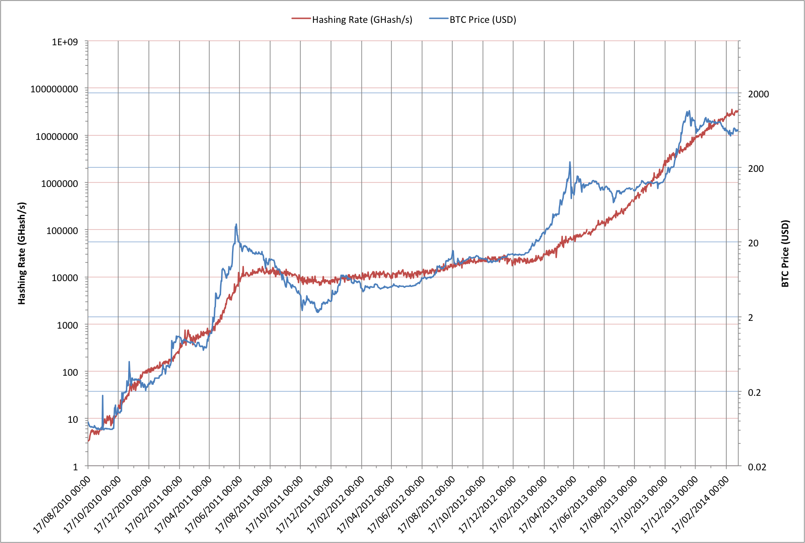

Which comes first: The miners or the money?  Much as the old question of
"Which came first: The chicken or the egg?" there appears to have been
a lot of debate about whether the price of Bitcoins is a result of
mining activity or whether mining activity is the result of the price of
Bitcoins.

The generally-held belief is that as the value of Bitcoins has increased
there has been more interest in Bitcoins and this has in turn driven
miners to mine, but is it really this simple?

Let's look at a chart comparing the value of Bitcoin in US Dollars vs
the global hashrate in GHash/s and see if we can make any sense of
this?

This chart is plotted on two logarithmic axis but they're not on the
same scale.  The price trace increases by approximately a factor of a
thousand but the hashing traces increases by approximately a factor of
ten million.  Essentially this means that the hashing rate has increased
56 times faster than the price.  There's nothing particularly
significant about the ratios other than that they let us watch the two
traces relative to each other.

We can see something a little curious here though.  The hashing rate
does indeed speed up as the price of a Bitcoin increases and the rate
slows once the price starts to fall but it's almost as if the hashing
rate has been acting as an anchor for the price.  If we think about the
hardware that has been used for hashing, however, there's an interesting
pattern.

In 2010 and the first half of 2011 miners could rapidly bring new
hardware on-stream in the form of CPUs and then GPUs.  In many cases
these were already available and so mining profitability didn't really
have to account for the hardware costs and people would want CPUs and
fast GPUs anyway.

From mid 2011 to early 2013 the initial euphoria waned, yet that seems
a little strange for something that had seen such rapid growth only a
short while earlier.  There were the [strange periodic spikes in the
Bitcoin price every 7-ish months]()
but neither the price nor the hashing rate really changed that much.
Roll forward to early 2013 though and things suddenly changed - a
lot.

In early 2013 Bitcoin mining ASICs started to take over the hashing
activity.  Unlike previous generations that used CPUs and GPUs that were
intrinsically useful for other purposes the ASICs weren't; they
weren't cheap either!  Suddenly a lot of Bitcoin miners were having to
pay a lot of money to mine Bitcoins but curiously the price started to
go up just as the ASICs started to become available.  Even more
curiously, the ASICs had long lead times so miners had made a financial
commitment to mining months in advance of their mining hardware being
available.  Was it just "good luck" that the Bitcoin price suddenly
surged, and then surged again, or was the price increase simply
reflecting that a lot of money had been spent to go
mining?

It seems quite possible that at least part of the reason for the surges
in the Bitcoin price is a result of the miners investing in mining.  The
price increases have encouraged more miners too and that means more
money spent on mining by those new miners.  This really does feel like a
"chicken and egg" problem.  A bigger question, however, is what happens
when the number of miners is large and the technology roadmap eventually
limits the ability to increase the hash rate?  At that point there will
need to be some other driver for any other price
increases.

---

## Data reference

Data for this article was sourced via [blockchain.info](http://blockchain.info)
