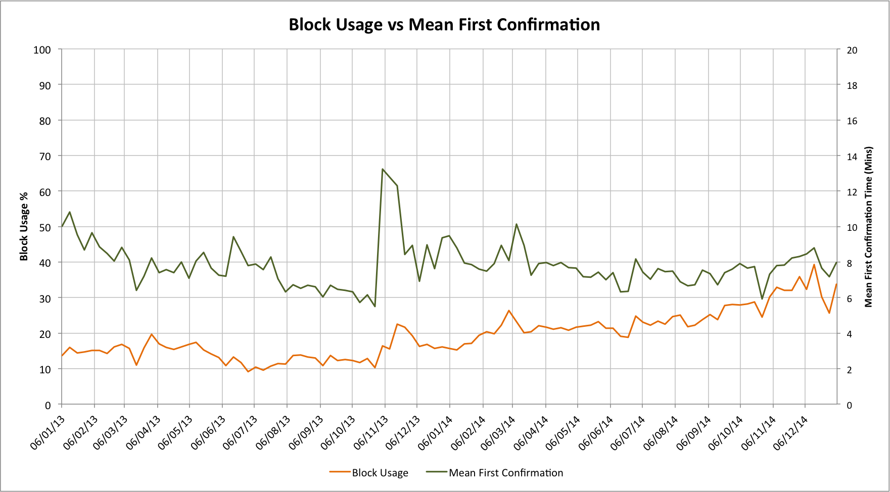
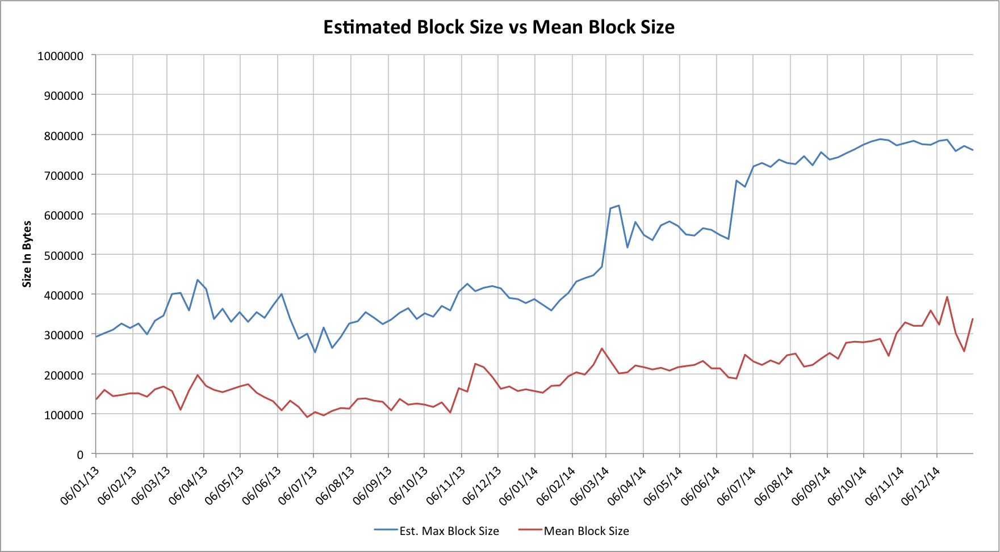
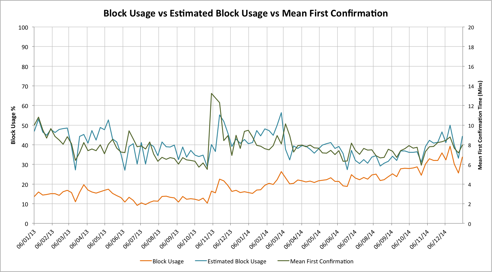

It's well described how Bitcoin has a one Megabyte block limit; it's
defined in the Bitcoin Core source code.  The knowledge of that 1 Mbyte
limit has even served in some of my analysis such as
"[The future of Bitcoin transaction fees?]()",
"[Bitcoin traffic bulletin]()"
and "[7 transactions per second?  Really?]()".
Turns out that I was wrong; in practice this limit is actually quite a
lot smaller!

## A puzzle

Back in "[Bitcoin traffic bulletin]()"
we saw how first transaction confirmation times were highly dependent on
how full mined blocks were.  Essentially anything larger than 30% started
to show noticeably slower confirmations than the default 415 seconds that
is seen when the blocks are pretty-much empty.  In fact the 415 second
number can be larger or smaller for both statistical noise reasons, or
if the global hash rate is increasing/decreasing (shorter if it's
increasing, longer if it's decreasing).

There was a slight puzzle for me; the older data seemed more erratic
than I'd have expected, but at the time I'd presumed that this was
down to changes in hashing rates and that the older versions of the
network had had longer latencies and more jittery propagation.

A couple of days ago, however, I spotted something very odd while
watching a series of blocks (block heights 338939 to 338942); they were
all the same size (731 kbytes), but that size wasn't anywhere near 1
Mbyte.  The 731 kbytes size seemed pretty weird too, until I realized
that this was a classic computer science numerology problem.  The Bitcoin
block size limit is 1,000,000 (1M) bytes, but typically memory sizings
aren't done in powers of 10, but instead in powers of 2, so 1 Mbyte of
memory is actually 1048576 bytes.  For anyone old enough to remember PC
floppy drives I leave you to actually work out the capacity of a 1.44
Mbyte floppy disk (I'll give you a hint, it needs you to use 1k bytes
and 1024 bytes :-)).  731k = 731 \* 1024 = 748,544 bytes; this is
actually 750k bytes minus a small amount.

Given this puzzle I generated some new data.  It looks at the theoretical
block usage vs the mean first confirmation time.  Let's look at it:

In the earlier assessment I'd noted that below a 30% block usage level
that the block utilization shouldn't really make much difference to the
confirmation delay, but in this graph the spikes in one are clearly
quite highly correlated with the other.  Correlation and causation are
two different things but, even so, this is pretty surprising!

If our actual maximum block size limit was actually somewhat less than
1M bytes, though, the estimate block usage numbers would be incorrect
and would need to be scaled up!

## An interlude on block sizing

Why would 750k bytes be being used instead of 1M bytes?  If one or more
miner was systematically generating smaller blocks than the theoretical
maximum then that would definitely affect all of my earlier estimates on
block utilization, mean confirmation times and block scarcity for mining
fees.

A little digging around in the Bitcoin Core git repository turns out to
be very useful!  The Bitcoin protocol implements a hard consensus limit
of 1M bytes on blocks, but actually has a default size for miners that
is actually smaller than this.  Individual transaction selectors
(generally mining pool operators) can set the value to anything up to 1M
bytes, but there are some defaults.

Since v0.9.0 (2014-03-09) the default maximum block size to be mined is
750k bytes, with up an addition 50k bytes for high priority transactions
(there aren't many of these).  A little more investigation also showed
that v0.8.6 had had the default maximum block size at 350k bytes and
prior to that the value had been 250k bytes!

If we were mining, why might we want to use smaller block sizes?  Well,
if we need to announce a mined block to the network it takes time.  If we
assume we need to tell 8 peers about any new block and our block is 250k
bytes in size, then that's 8 \* 250k \* 8 = 16M bits.  If our miner had
a DSL line with only a 1 Mbps uplink then by the time we've added
network protocol overheads then this block will take about 20 seconds to
transmit!  That's a very long time, especially in situations where two
blocks are found at almost the same time.  If the block had been 1M bytes
then it would have taken 80 seconds!  In practice large mining pools will
have much faster network connections than this now, but network
bandwidth still plays an effect.

Back to our original problem, however!  The problem with miners selecting
a smaller maximum block size is that if the network is heavily loaded
then our miner is effectively leaving transactions waiting when they
declare a block "full" at some level below 1M bytes.  Far from the 3.2
transactions per second that we thought the network could sustain in
"[7 transactions per second?  Really?]()",
every miner imposing a 750k bytes limit would mean the network capacity
was actually only 2.4 TPS!

## What is the effective block size limit?

With good historical data we can estimate the actual block size limit
for various miners.  If we look at the largest block mined by specific
pools in given weeks we can estimate the upper limits that they were
actually using.  If we multiply these by the fractions of the numbers of
blocks each found then we can estimate the actual block size capacity of
the network over time:

This isn't a perfect approach.  Smaller pools will see their results
skewed because they don't find enough blocks, but the effect is
interesting.  Over the last two years the effective block size has
steadily been growing, and if anything has, until a few months ago,
slightly outpaced the growth in actual block usage.

## Mining pool behaviour

The raw data is also a source of some interesting discoveries.
Individual pool operators sometimes try to optimize things in
interesting (and quite different) ways.  Here are some examples for some
of the larger pools:

- Antpool never adopted the 350k bytes value and jumped from 250k to
  750k in June 2014.
- BTCGuild adopted 475k bytes in March 2013, then 500k bytes from
  August 2013.
- The now defunct DeepBit pool never went over 100k bytes.
- Discus Fish (F2Pool) switched from 250k bytes to 32k in
  December 2013.  After 6 weeks they variously tried 48k and 64k sizes
  for a few weeks each before adopting 916k in March 2014, then 933k
  in August 2014.  In October 2014 they systematically started mining
  at 1M bytes; as such they consistently mine the largest blocks of
  all pools.  Discus Fish also, curiously, mined a very large number of
  0 transaction blocks for during the middle of 2014, suggesting some
  other peculiarities in their block selection.
- Until November 2013 Eligius appears to have tried many quite large
  block sizes, before adopting a value just over 900k bytes.
- GHash.IO ran with the 750k default for 2 weeks in March 2014 before
  moving back to 350k until late June.  Their switch to larger blocks
  coincided with their decline in peak hash rate from a mean of 40% of
  the network.  Curiously, both times they moved to 750k there was a
  corresponding large drop (about one sixth) in their share of the
  network; this could be complete coincidence but perhaps not!
- Megabigpower has highly erratic maximum block sizes; the variation
  is seemingly far too large for their share of the network, with
  smaller pools showing dramatically more stability.  This perhaps
  implies that they are using some sort of custom maximum block size
  estimation software.
- Most of the "unknown" hashing seems to be done by miners using the
  default sizes.

## So does this explain our original chart?

Let's look at our original one but now with the estimated block usage
too:

 

This is quite striking, even more so if we realize that in late 2013 and
early 2014 we were seeing huge hash rate expansions which in turn reduce
the confirmation times as blocks were being found much more quickly than
one per 10 minutes.  The higher effective block usage (above 30%) also
goes a long way to explaining why our original chart was much more
highly correlated than we expected.

## Implications

The implications of these results are intriguing.  We can certainly see
that the current network can't actually handle even the modest
transaction rates we originally assumed, although it's easy for mining
pool operators to adjust for this.  That this is up to the majority of
mining pool operators is potentially the most interesting realization.

Back when GHash.IO was approaching 50% of the network there was a lot of
concern about what this meant for the potential to double-spend, etc.  In
practice, such a risk seems unlikely as that would damage the very
ecosystem that supports mining.  A subtlety, however, is that GHash were
only actually allowing 350k bytes per transaction.  Where they controlled
40% of the total block space they only actually allowed 35% of that 40%
to be used; a net loss to the network of 26% of its total theoretical
capacity.  The jump when they switched to 750k byte transactions is
actually quite marked in the second chart!

The confirmation time statistics suggest that even if, mid 2014, they
had tried to use relative scarcity to select higher fee transactions it
probably would have had little impact.  The next large pool, if in a
position to dictate block scarcity, has the potential to be much more
disruptive as a result of transaction selection.

There is also an interesting implication for Gavin Andresen's proposed
protocol fork that would allow larger blocks.  If the majority of mining
pools (by total capacity) choose to ignore some new upper limit then the
effect will be to retain a much smaller overall cap.  Miners may, indeed,
want to do exactly this as block scarcity is the only thing that has any
reasonable prospect of helping them achieve higher transaction fees.

For observers of the Bitcoin network we do seem to have a new health
indicator: A periodic report on the mean, minimum and maximum block
sizes mined by various pools and their associated statistical
likelihoods could be very interesting.

---

## Acknowledgments

Many thanks to [\@oocBlog](https://twitter.com/oocBlog) (author of the
"[Neighbourhood Pool Watch](http://organofcorti.blogspot.com)" blog;
well worth reading every week).  After I spotted the trends that led me
to speculate about block size limits he generated the raw data that I
needed to perform my analysis.

---

## Data reference

Data for this article was sourced via [blockchain.info](http://blockchain.info)

---

## Source code

When I came to write this article I also wrote a C++ application that
would combine all of the raw data into a form I could use with Excel to
generate the charts.  The source code, and the source CSV data files can
be found on github: <https://github.com/dave-hudson/the-myth-of-the-megabyte-bitcoin-block>

---

## Related articles

- [The future of Bitcoin transaction fees? (2014-11-12)]()
- [Bitcoin traffic bulletin (2014-11-11)]()
- [7 Transactions per second?  Really? (2014-11-02)]()
