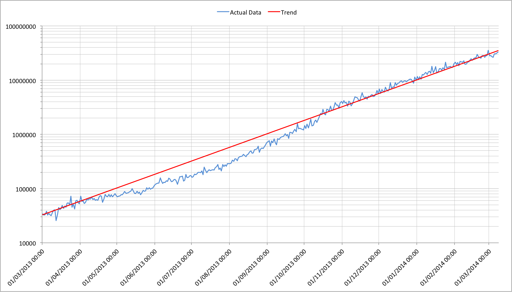

Bitcoin mining is seemingly unique.  There has probably never been any
technology problem that has triggered such sustained growth and it may
be a very long time before we see another one.  A convergence of the
scalable Bitcoin protocol design, readily available technology, money
and mining incentives have accelerated this particular mine train in a
truly explosive way.  Let's look at the trends and what they suggest for
future mining activities.

## What has been happening?

There is probably a lot to be said for looking at the history of Bitcoin
mining prior to the last 12 months but it's more interesting to look at
how it has progressed since the introduction of ASIC (application
specific integrated circuit) mining.  We might argue that this is the
point at which mining started to become a professional task since the
hardware involved can't be used for anything else.  Previous generations
used hardware that was originally designed for other purposes and so let
amateurs play too.

Let's look at the worldwide hashing data:

The first thing to notice is that this isn't an ordinary graph.  It's
plotted on a logarithmic Y axis meaning that each major graduation is 10
times larger than the one below.  If we look at the red trend line though
it's a straight line, signalling that we have had exponential (runaway)
growth.  There was a small period of time before the value of Bitcoins
soared late in 2013 where things had slowed down but then everything
caught up (which rarely happens with technology problems).

## Exponential growth

It's useful to think about what that red trend line shows us.  What we
see is that in the last 12 months the worldwide hashing rate has
increased by a factor of approximately 1000.  That means that roughly
every 4 months it got 10x larger, that it doubles almost every 37 days
and that it increases by almost 1.9% per day!  We don't know how long
this trend will continue but it has been somewhat stable for the last
year.  Given that newer and faster ASIC hardware is due to ship
throughout the next few months it seems likely that it will continue for
some time yet.

## The economics of professional mining

Bitcoin mining is a zero-sum game; if one player wins then everyone else
has to lose.  When the value of Bitcoins increases it means that even
winning a small share of the total can be highly valuable so, rather
than play alone, most people join a mining pool.  Mining pools let a
player win fractions of the payout to that pool in proportion to the
resources supplied to the pool but what we've just seen is that any
resources a player contributes are reduced by almost 1.9% per day.  After
a week they're down by more than 12% and after 37 days they're only
50% of what they started at.

What this really means is that mining equipment has a staggering level
of depreciation.  If the value of a Bitcoin doesn't change in that 37
day period then the mining hardware is only producing half of the value
it started with.  After 74 days it's a quarter and after 4 months it's
only a tenth.  It quickly reaches the point where the operating cost
(OpEx) outweighs the value of what's being produced and the hardware is
worthless.  At this point the entire capital cost (CapEx) of buying the
equipment is wiped out.

Almost nothing else we encounter works this way; consider that servers
in a data centre or a laptop may be assumed to have a useful life of 3
to 5 years, while a car would typically be more than 10 years.  With a
stagnant Bitcoin price, mining hardware has depreciated to just 1% of
its original value in 8 months and its useful lifespan (where it
produces more value than it costs to operate) is probably much shorter!
Even if the value of Bitcoin increases by a factor of 10 it still only
defers the huge reduction in capital value by 4 months.

## How does this affect the hashing rate?

The huge rate of depreciation means that there's only one sensible
approach that a bitcoin miner can take: Run the hardware 24/7 at the
highest speed that doesn't cause it to break from the moment it arrives
until it's no longer generating more value than it costs to run.  Not
doing this simply means a miner is losing the most valuable portion of
their hardware's life.

This simple rule has an important consequence; It guarantees a constant
supply of the newest and fastest hashing engines driving the worldwide
hashing rate.  Once an order is placed a miner is committed to fueling
this expansion.  Unlike the rides in theme parks around the world, this
particular runaway mine train isn't slowing down for anyone!
