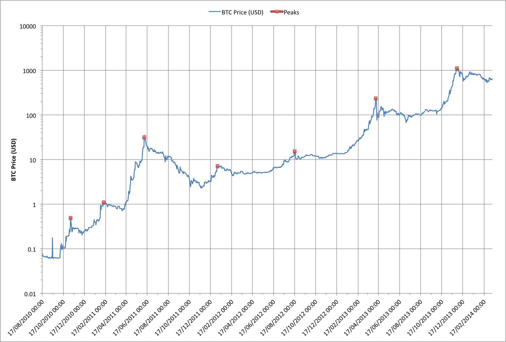

There's something odd about the fluctuations in the price of Bitcoins.
The data shows a set of spikes when the price jumps up and then falls
back somewhat and levels out. This wouldn't be so unusual if the spikes
occurred intermittently but in the case of Bitcoins the spikes happen
with a very surprising regularity!

Let's look at the graph:

The first thing to note is that the graph is plotted with a logarithmic
Y axis so each step indicates a price point ten times larger than the
one below. Using a log scale means that we see patterns in the relative
change in price much more easily, rather than changes in the actual
value.

There are 7 major spikes in the Bitcoin price starting on 17th November
2010 and finishing on the 30th November 2013. If we ignore the spike on
10th February 2011 the other 6 spikes have an amazingly consistent
spacing!

All of the major price spikes also show another remarkable similarity.
In each case the price ramps up very quickly, hits its highest point for
a a day or two and then slowly drops off.

So there are a few big questions (to which I don't have any answers
right now):

- Why does the price spike up every 7 to 7.5 months?
- Why does the price never drop back below where it starts from?
- Is the behaviour just coincidence or is someone or something
  triggering it?

Does anyone have any data that might explain this?

\[Data reference: [blockchain.info](http://blockchain.info)\]

------------------------------------------------------------------------

## Related Articles

- [Strange Spikes Revisited? (2014-06-05)]( {{relref "../2014-06-05-0000" >}} )
