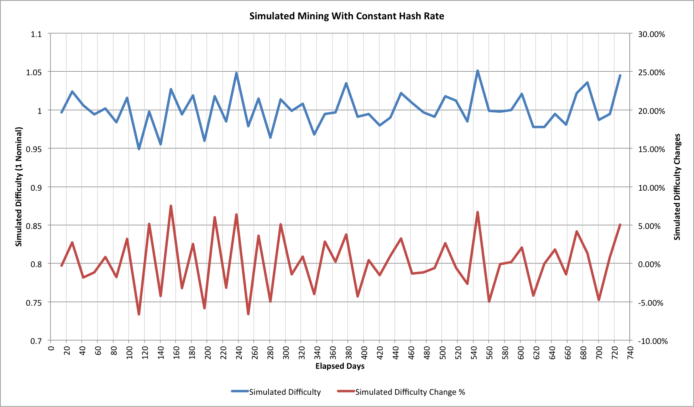
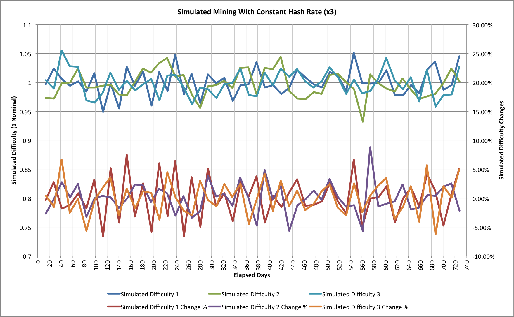

Everyone knows that mining is a noisy task.  Did you realize just how
noisy Bitcoin mining is though? These aren't the noises you were
looking for...

## 

## A Simple Question

An earlier article, "[Hash Rate Headaches](index.php?option=com_content&view=article&id=27:hash-rate-headaches&catid=8:analysis&Itemid=110)",
looked at the statistics associated with Bitcoin mining and how it is a
random Poisson Process.  It was pretty clear that the global hashing
rate, and thus the Bitcoin mining difficulty, are subject to quite a lot
of noise, but it wasn't completely obvious how much.

One way to think about this is to ask a simple question: If the hash
rate stayed constant for 52 difficulty changes (approximately 2 years)
then what would happen to the Bitcoin difficulty during that time?

Intuitively it seems that the difficulty shouldn't really change, but
what are the statistics? This seemed like an interesting thing to try to
unravel so I built another simulator (it's another one written in C,
please [contact me](contact) if you'd like to know more about it).

## A Simple Mining Simulation

The simulation sets up a nomalized difficulty of 1 and then models each
individual block being found.  Every 2016 blocks it then updates the the
difficulty and the random mining continues.  It's not a perfect
simulation because it ignores network latency or the possibility of
orphaned blocks, but these have a very small impact.  Here's one run:

This is just one of many random simulation runs.  The difficulty changes
are somewhat suprising.  On 7 occasions the difficulty increases by more
than 5% and on 3 it reduces by more than 5% (over a much larger number
of runs the number higher and lower are typically the same; in this
instance if we move the threshold to 4% then it's 8 higher and 7
lower).

Our intuition about the difficulty basically staying the same isn't
actually wrong, it's just that that's an average behaviour.  Run the
simulations for long enough and everything levels out.  Each set of 2016
blocks takes almost exactly 14 days to find.

Doubters may question the simulation because negative difficulty changes
have been so rare, but for most of the last 5 years the hashing rate has
been climbing.  Even when it wasn't climbing at current levels though it
was still generally increasing.  With this first simulation, as long
as the hashing rate increases by more than 5% then we will rarely see a
negative difficulty change.  By Bitcoin standards, 5% is a very gentle
growth rate.  If we have 14 successive difficulty changes of 5% then we
end up at 1.98x the original hashing rate.  That same 14 difficulty
changes would take 186.7 days; more than 6 months.

It's a little difficult to extract the increase in hashing rate from
the current difficulty levels, but let's assume it has had still a
steady exponential growth.  The steady rate would be 16.9% for the last 4
months.  The assumption doesn't strictly hold as we're seeing a gradual
slowdown but even with the simplification we can still see that the
variance from our 16.9% is very similar to what the simulation shows:

| Date       | Difficulty  | Change | Variance |
| :--------- | ----------: | -----: | -------: |
| 2014-05-24 | 10455720138 | 18.10% | 1.20%    |
| 2014-05-12 | 8853416309  | 10.66% | -6.24%   |
| 2014-04-29 | 8000872136  | 14.64% | -2.26%   |
| 2014-04-17 | 6978842650  | 14.04% | -2.86%   |
| 2014-04-05 | 6119726089  | 22.23% | 5.33%    |
| 2014-03-24 | 5006860589  | 17.80% | 0.90%    |
| 2014-03-13 | 4250217920  | 11.39% | -5.21%   |
| 2014-02-28 | 3815723799  | 21.92% | 5.02%    |
| 2014-02-17 | 3129573175  | 19.39% | 2.49%    |
| 2014-02-05 | 2621404453  | 19.49% | 2.59%    |
| 2014-01-24 | 2193847870  | 22.59% | 5.69%    |

The variations here are slightly larger than we would expect for just
our random noise but the rate at which hashing is added to the network
can't be completely steady.  The behaviour is very close to what the
statistical model predicts.

One simulation isn't anywhere near sufficient of course.  As we compare
more trials though the behaviour is essentially the same.  Here are 2
different simulation runs overlaid on top of our original one:

The good news for miners is that for every spike that goes up there's
one that goes down, but the cries of despair from the latest 18.10%
difficulty change are already echoing around the Internet.  Unlike space,
where no-one can hear your scream, it seems that in Cyberspace a little
noise can sometimes be very loud indeed!

------------------------------------------------------------------------

## Related Articles

- [Hash rate headaches (2014-05-20)]()
