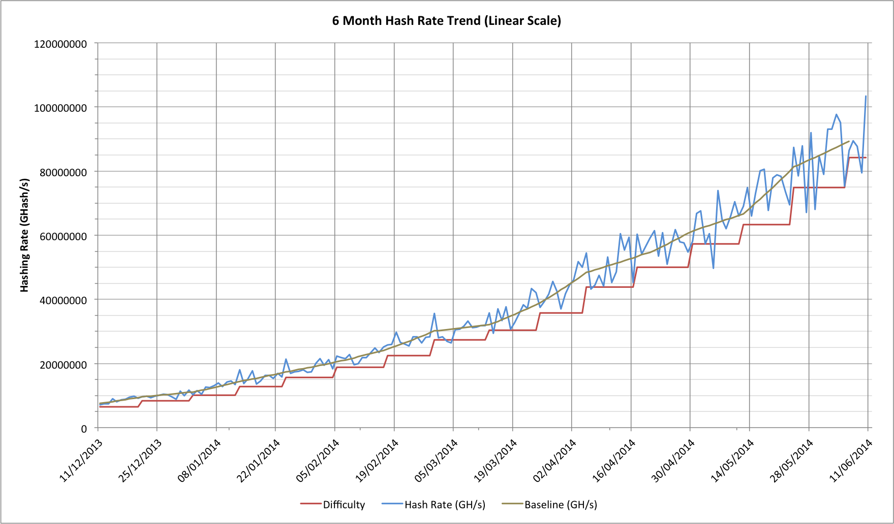
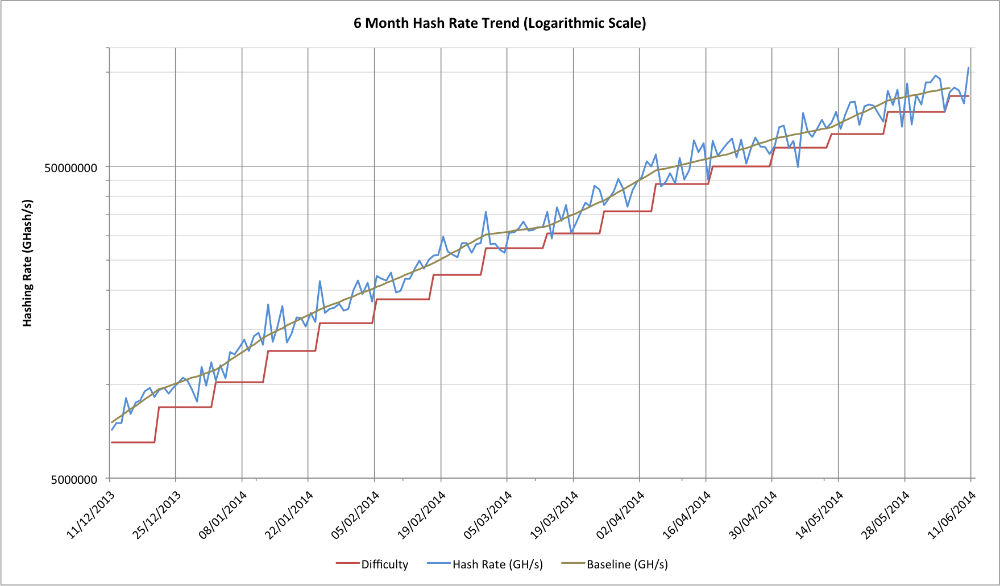
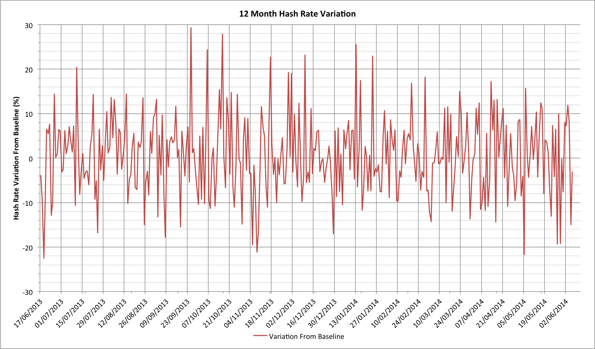
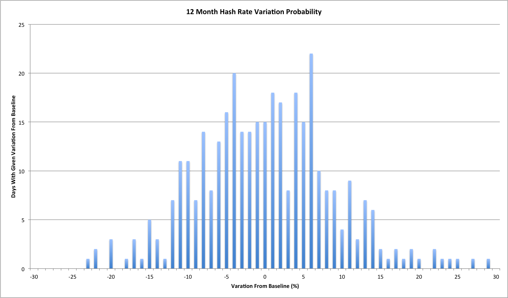

Bitcoin difficulty and hash rate statistics should be considered an
illness.  The symptoms include anxiety, depression, sleeplessness and
paranoia.  Bitcoin miners follow their every movement, rejoicing at
smaller-than-expected difficulty changes and collectively dismaying when
things go the other way.  Authoritative-looking charts have people
puzzling about why things are so erratic and chasing non-existent mining
conspiracies.  The truth is out there\...

## Difficulty charts

When we start to think about mining, difficulty charts are not far away.
Most of them are presented something like this:

This chart shows the last 6 months of daily hash rates and the rising
difficulty.  It also shows a baseline trend line but we'll look at that
a little later.

Aside from that inexorable increase in difficulty and the cries of woe
from miners watching it, the most striking characteristic is that way
it's getting progressively much more \"spiky\"!  Look at how smooth it
used to look?  In fact this assessment is actually just plain wrong; if
you were to look at 6 months of data starting 3 months earlier then that
nice \"smooth\" part would end up looking just as bad as the most recent
data.  The problem is a question of scale; the variations in the hash
rate become numerically larger as the overall hash rate increases.

When confronted with this sort of data, many statisticians switch to
logarithmic graphs instead of linear ones because log charts show the
magnitude differences rather than absolute differences.  Here's the same
data on a log chart:

Notice how the spikes in the blue hash rate look pretty much the same
all the way across now?  If you're observant you might argue that the
ones on the left are slightly less spiky, but that's because the slope
of the graph is steeper there.  Even there though it's clear that the
statistical noise on a day-to-day basis is actually much larger than the
overall trend.  That overall trend shows that hashing rate, and thus the
difficulty, increases are slowing down for now (and probably for the
forseeable future).  The slowdown wasn't evident on the linear scale
graph and so we can see another advantage of logarithmic scale graphs.

## Calculating a baseline

Most Bitcoin miners tend to think in terms of \"difficulty\" because
it's what determines the complexity of any mining.  On both of the
graphs we've just looked at, though, the difficulty is clearly lagging
behind the hash rate.  The problem is that it's set retrospectively, and
set at a level that would make the preceding 2016 blocks take exactly 14
days to find.  This means that the difficulty lags around 5.5 to 7 days
behind the actual hash rate even when it's changed.  If we want a real
baseline to think about hash rates we need something more up-to-date.

In both of the charts we've just seen there is a baseline trace, and
that trace represents \"something more up-to-date\".  The baseline is
calculated by looking at the days where the difficulty changes and
taking the square root of the ratio of a new to previous difficulty
level and then multiplying it by the new difficulty.  In-between these
fixed points is an interpolation that assumes a steady percentage growth
rate between them.

This particular baseline isn't perfect because it has no way to account
for statistical noise in the hashing rate (see \"[Hash rate
headaches]()\")
but it turns out to be a surprisingly effective estimate nonetheless.

## Checking the baseline

Visually our baseline looks pretty reasonable.  We know that even if the
hash rate was constant the difficulty would change as a result of random
noise (see \"[Reach for the ear defenders]()\").
The question is what does our noise profile look like if we subtract out
the baseline hash rate estimate?  This should approximately follow
Bitcoin's Poisson process' noise profile and should oscillate about
zero.  Here's what it actually looks like for the last 12 months:

Comparing this with what simulations suggest for 24 hour variations this
looks remarkably consistent.  This pretty-much suggests that there's
been very little if anything unusual happening over the last 12 months
and that hashing capacity has been reasonably steadily added throughout.
One final check though is to look at the probability histogram for the
variations about our baseline:

While it's not perfect, it has just the sort of probability
distribution we would expect to see.

## What have we gained?

We started out trying to understand how key statistics were presented.
We've seen how linear charts can be highly misleading.  By devising a
way to estimate the hash rate baseline, we've been able to go one step
further and see just how much the day to day hash rate estimates will
oscillate quite wildly.  We can now be confident that even 20% swings
from the estimate are surprisingly likely, and that day-to-day swings
can be even larger!

The gods of statistics didn't want us to worry about what happens in
the course of hour or even a few days; those numbers, tantalizing as
they may seem, are largely meaningless.  They are the lies among the
truth that only becomes apparent over a much longer timescale.

\[Data reference: [blockchain.info](http://blockchain.info)\]

------------------------------------------------------------------------

## Related articles

- [Reach for the ear defenders! (2014-05-24)]()
- [Hash rate headaches (2014-05-20)]()
