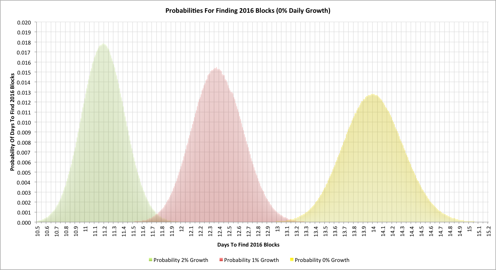

2016 blocks is the magic number that corresponds to each change in
difficulty within the Bitcoin network. Nominally it should take 14 days
to find this many blocks, but how long does it really take?

## The simple case

In an earlier article, "[Hash Rate Headaches](index.php?option=com_content&view=article&id=27:hash-rate-headaches&catid=8:analysis&Itemid=110)", I
looked at the probabilities of finding a particular number of blocks in
a given time. This time around the goal is to work out how long it takes
to find 2016 blocks.

To work out the behaviour I wrote a Monte-Carlo simulation that models
the behaviour of mining during a 2016 block period. The simulation was
run 10 million times in each run shown here in order to get good
smoothing of the data.

Let's start with the simple cases where the global hashing rate isn't
changing:

As we'd expect, the average time to find 2016 blocks is indeed 14 days.
We can see the effects of the
[noise](index.php?option=com_content&view=article&id=28:reach-for-the-ear-defenders&catid=8:analysis&Itemid=110)
in the hashing design though and how once every 10 difficulty changes
we'd be likely to see the time at +/- half a day (i.e. 13.5 days or
less, or 14.5 days or more).

## Practical complexities

[Previously](index.php?option=com_content&view=article&id=27:hash-rate-headaches&catid=8:analysis&Itemid=110),
I've talked about how Bitcoin hashing is a Poisson process.
\@coinometrics pointed out on Twitter that things become more complex
when the hashing rate is expanding because it then becomes a
non-homogeneous (or inhomogeneous) Poisson process. Towards the end of
the difficulty change we're going to see blocks being found faster than
at the start. The observation is, of course, quite correct and the
simulations here now account for that. The assumption is that hashing
capacity comes online at a steady exponentially expanding rate, so, say,
the hashing capacity assumed at 5 days is larger than that at 4.9 days,
irrespective of the number of blocks found.

Another complication is that the current difficulty level doesn't
really indicate the the actual hashing rate of the network even on the
day it's first set. In the article, "[Lies, Damned Lies And Bitcoin Difficulties](index.php?option=com_content&view=article&id=29:lies-damned-lies-and-bitcoin-difficulties&catid=8:analysis&Itemid=110)",
I showed that a more accurate starting measure was to multiple the new
difficulty by the square root of the difficulty increase. The
simulations account for this too.

Let's see what happens when we have a 1% daily hashing rate expansion:

With a 1% daily expansion rate we now typically find our 2016 blocks
after 12.37 days (a little under 12 days, 9 hours). It also equates to a
difficulty increase of 13.1%.

Now let's look at a 2% daily hashing rate increase:

With a 2% daily expansion rate we now typically find our 2016 blocks
after 11.19 days (a little over 11 days, 4.5 hours). This equates to a
difficulty increase of 24.8%.

It's interesting to note that doubling the hashing rate expansion per
day doesn't correspond to doubling the next difficulty change because
we get to the next change quicker and thus compensate faster too.

The numbers also have an interesting implication for the block reward
halving dates though as the dates move closer all the time.

## Putting it all together

Here's a final chart. This shows the 3 earlier charts superimposed on
each other:

It's worth noticing the effect of noise again. The overlaps between the
2% and 1% expansion rate are pretty clear. When we see a difficulty
change at 11.75 days are we really seeing the effect of 13.1% extra
hashing capacity, 24.8%, or more likely somewhere inbetween? It could be
even more divergent though!

Over the last few days there has been much discussion about the GHash.IO
mining pool's hashing rate. It clearly has a very substantial fraction
but the error margins even across an entire 2016 block period are
surprisingly large. As ever Bitcoin statistics often lead to more
questions than answers!

------------------------------------------------------------------------

## Related articles

- [Lies, Damned Lies And Bitcoin Difficulties (2014-05-10)](index.php?option=com_content&view=article&id=29:lies-damned-lies-and-bitcoin-difficulties&catid=8:analysis&Itemid=110)
- [Reach For The Ear Defenders! (2014-05-24)](index.php?option=com_content&view=article&id=28:reach-for-the-ear-defenders&catid=8:analysis&Itemid=110)
- [Hash Rate Headaches (2014-05-20)](index.php?option=com_content&view=article&id=27:hash-rate-headaches&catid=8:analysis&Itemid=110)
