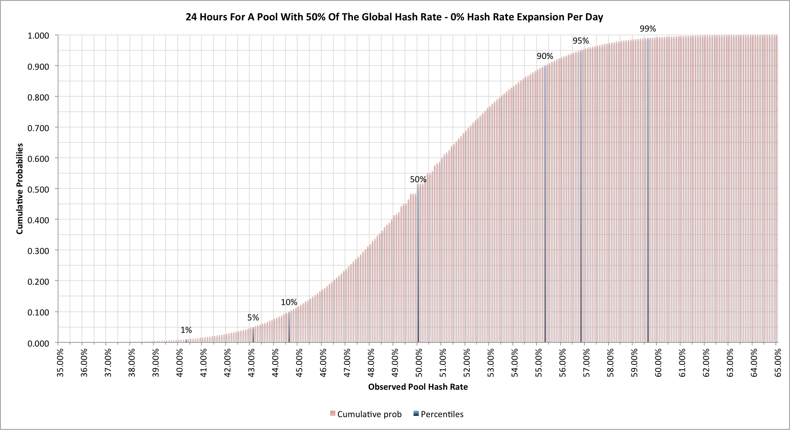
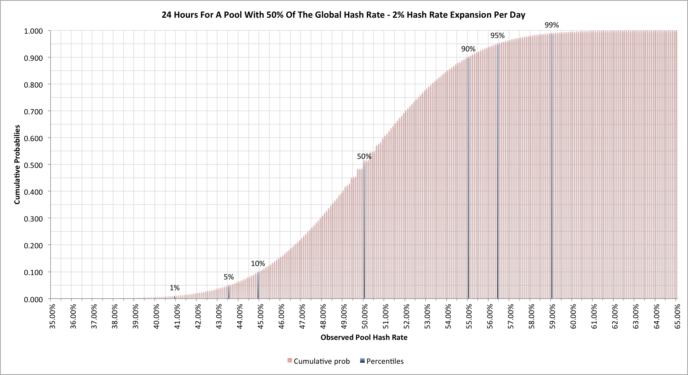
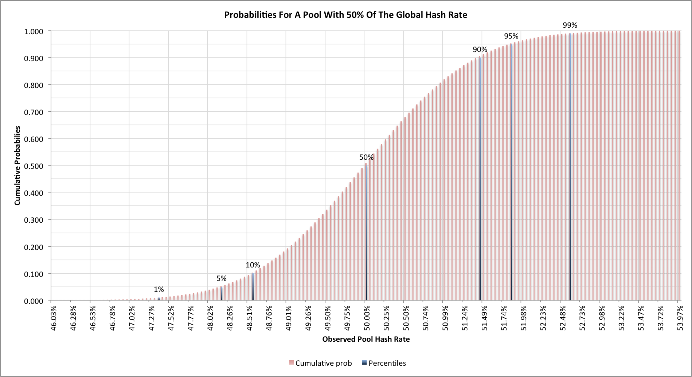

Every so often a Bitcoin mining pool is reported to manage more than
half of the Bitcoin hashing capacity, exposing the spectre of a so
called "51% attack".  Ignoring the perceived threat though, can we
really trust the statistics?  We've seen, previously, that Bitcoin
mining statistics aren't quite as obvious as we might hope, so what do
they look like in these cases?

## A day in the life of a 50% mining pool

Let's look at what happens when a Bitcoin mining pool has 50% of the
actual global hash rate and see what the estimated statistics look like
for 24 hours.  We'll start by considering what happens when there's no
expansion occuring in the network.  Here's what we find from a Monte
Carlo simulation with 10M trials:

One curious thing is to note that around the 50% level we see the
cumulative statistics actually become a little "blocky" but that's
because there turn out to be a limited number of values that can occur.

With 50% of the hashing capacity we do indeed see an average rate where
50% of the blocks are found by our mining pool, but one day in ten
we'll see the network hashing rate for the pool at 43.1% and less, or
56.8% or more.  In practice if we're not seeing more than 50% every
other day then the pool we're looking at probably doesn't really have
at least half of the network hash rate; an odd day above is really not
as interesting.

Let's see if it makes much difference if our network hash rate is
expanding at 2% per day:

The 2% per day hash rate expansion is pretty extreme, corresponding to a
difficulty change of 24.8% on average, but this doesn't actually make
much difference.  Our "once in ten days" metric now has ranges of 43.5%
or less and 56.4% and greater.

## 50% for 2016 blocks

We've seen what happens on a daily basis, but what happens when we look
at the 2016 block difficulty change?  Here's the simulation for the
network when no expansion is occuring:

Even over 2016 blocks (14 days on average) we can see quite a lot of
variability in the measured hash rates.  One difficulty change in five
we'll see a discrepancy in the estimated pool hash rate of more than
+/- 1.4%.

## Final thoughts

As with many of the Bitcoin statistics we've seen, things are rarely as
clear-cut as they first appear.  We really need to see more than 55%, and
probably close to 60%, of the hash rate being assigned to a pool within
any 24 hour period before that alone is sufficient to say that the pool
has achieved 50% of the network hash rate.

None of this diminishes the potential risk associated with a single
owner gaining a majority of the network hashing, but as we've seen
before, we should be wary that daily statistics alone aren't enough to
show that this level has been reached.

------------------------------------------------------------------------

## Related articles

- [Lies, damned lies and Bitcoin difficulties (2014-06-10)]()
- [Reach for the ear defenders! (2014-05-24)]()
- [Hash rate headaches (2014-05-20)]()
