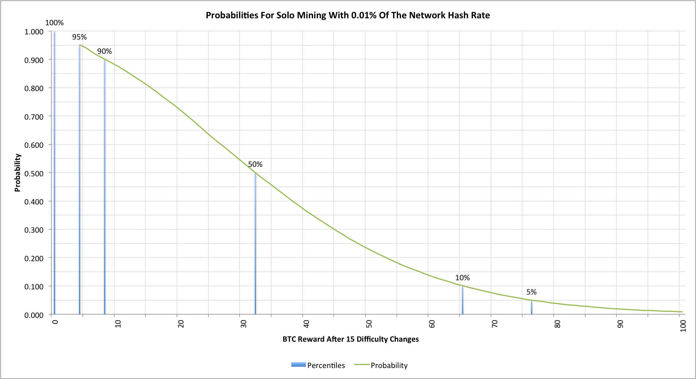
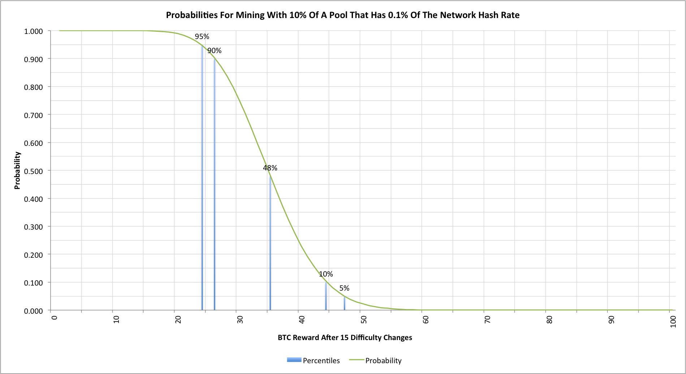
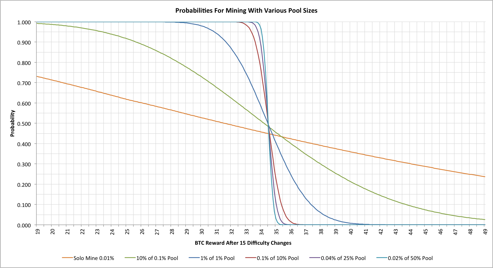

What's the best way to get a return when we mine Bitcoins? Should we
mine on our own, mine with a small pool or mine with a large pool? How
much difference does it really make?

Whether we want to be a gambler or an investor is really a question of
how much risk we're prepared to take, but what are those risks and what
are the odds of success?

## Starting thoughts

Before we can look at the odds of getting a particular return we need to
establish a few starting conditions.  Let's assume that we're planning
to mine using hardware that, at the outset of our mining, is able to
hash at 0.01% of the total global hash rate.  If we have 120 PH/s of
hashing then that means that we have 12 TH/s of hashing hardware, but if
that global rate was 600 PH/s then we'd need 60 TH/s.  The actual
numbers don't matter though, just the percentages.

We're going to assume that the network is expanding at 1% per day.  For
most of 2014 it has been above this but the trend is generally downwards
and we need to assume something. At 1% per day then over 6 months
(approximately 183 days) we'd see the global hash rate increase by a
factor of 6.177 by the end, so our 0.01% of the network is only
0.0016188% after the 6 months.  We're not expecting to add new capacity
as we go though, so we only have the hardware that we start with.

Bitcoin mining is highly erratic (see "[Hash rate headaches]()")
so it's not easy to calculate how our mining will progress so instead I
built a Monte Carlo simulator.  The results presented here all come from
that simulation with 10M simulations of each scenario to ensure that the
data is well smoothed.

## Solo mining

Let's start with the simplest case.  We're going to assume that we'll
use all of our hashing capacity to mine for blocks on our own.  What
might we expect?

The chart shows 15 difficulty changes (6 months).  It plots the
cumulative probability of achieving a particular BTC reward.  50% of
miners will achieve 32 BTC or less at the end of the 6 months, while 5%
will receive nothing at all! It's not possible to get smaller amounts
in this time period by solo mining so that's why there's a
discontinuity in the graph at the start.  10% of miners will actually
receive 65 BTC or more.

The gambler in us might be attracted to the potential for high rewards;
that part of us that wants to be an investor though is probably going to
look at this graph in horror!

## Mining with a pool

The easiest way to mitigate some of the risk is to join a mining pool.
Let's ignore pool fees or anything that doesn't just give an equal
share for hashing capacity provided to the pool.  What might the same
hardware achieve when run this way?

Our gambler self may be disappointed to see that the potentially large
payouts have vanished; 10% of miners will achieve 44 BTC or better.  Our,
more rational, investor self is probably much happer though as only 10%
of miners achieve less than 26 BTC.  The simple exercise of merging with
a pool that has 10x the total mining capacity has made a huge difference
to the variance of the mining rewards.  Our 50% reward point is higher
too (the chart shows 48% to keep things simpler)!

## What are the effects of using larger mining pools?

Now that we can see the reduction in variance from using a mining pool
we really need to ask questions about just how much does the mining pool
size change the statistics.  In order to do that we need to consider a
few different ways to deploy our hardware.

The following graph shows a much narrower span of BTC rewards.  It also
shows the effects of mining as part of a pool controlling 0.1%, 1%, 10%,
25% and 50% of the global hash rate.  That last one is sure to be
controversial as a pool with 50% of the hash rate is deemed to pose a
potentially serious risk, but rational miners have been keen to
participate in such pools.  Just how good are the reasons to do so?

The first things to notice are just how bad the solo mining and 10%
membership of 0.1% pool now look! The larger pools are definitely more
attractive to anyone seeking predictable returns.

## Mining pools are here to stay?

In a simpler world the Bitcoin mining network might only be expanding
very slowly and miners could attempt to allow time to smooth out the
effects of mining variance.  In practice though, as the network expands
and the ever-increasing difficulty consumes the usefulness of any
current hardware, then best known way to avoid the vagaries of random
mining behaviour is to use large blocks of co-ordinated mining.  Solo
mining and mining in small pools is a strategy for gamblers, not
investors.

Arguments may rage regarding the risks posed by large mining pools and
their tendency towards centralizing our supposedly decentralized
network, but it seems very unlikely that they will be disappearing any
time soon.  Any proposal to remove them will have to address the issue of
variance if it is to gain any sort of widespread acceptance.

------------------------------------------------------------------------

## Related articles

- [51% of the network (2014-06-23)]()
- [Hash rate headaches (2014-05-20)]()
