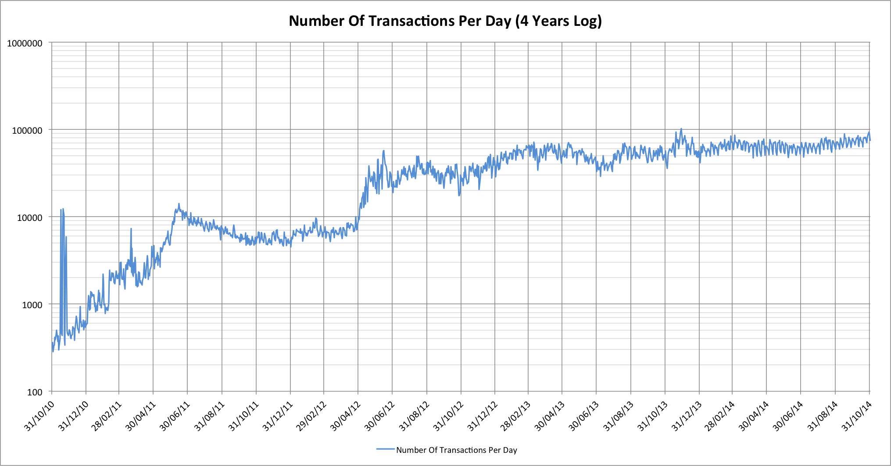
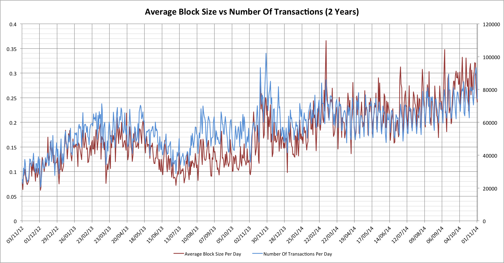

The general wisdom seems to be that the Bitcoin network can currently
sustain 7 transactions per second.  Bitcoin advocates often worry that
this will be a limiting factor when credit card processing networks can
handle several orders of magnitude more transactions in the same time,
but what are the actual statistics related to Bitcoin transaction
processing?  Our Bitcoin [mine train]()
may not be seeing its hashing engines running away quite as much as they
were earlier this year, but are we heading for other problems instead?

## Bitcoin transactions per day

Before we can really think about Bitcoin transaction processing we need
to look at how its transaction processing has evolved over time.  Let's
start by looking at the numbers of transactions per day for
approximately the last 4 years:

As with all of our Bitcoin rollercoaster rides there are highs and lows,
but the trend is generally up over time.  It may not be the sort of
exponential growth seen with the global hash rate but it's hard to
argue that the number of transactions hasn't been going up.  It's
looking much more erratic as we move to the right but we've seen that
sort of thing before and it's usually because the percentage swings are
the same but the larger numbers makes things look worse.  One solution is
to look at this on a log scale:

With this view the growth may not look quite as impressive but we can
see that the daily variations really aren't anything new.

What else can we see?  Well we're not really getting to more than about
80k transactions per day right now, or just under 1 per second.  On the
surface it would seem that we ought to be quite some way from hitting
any limits.

## A quick aside: The Bitcoin network gets tired on Sundays?

Did you notice that the noise over the last year looks surprsingly
periodic?  Zooming in on this we can see that's surprisingly consistent!

The horizontal axis grid lines correlate to Sundays.  For some reason the
Bitcoin transaction processing network doesn't seem to get used as much
on Sundays; it's down about 20% on the rest of the week?  No I don't
know why this happens either!  Perhaps it gets tired and needs a nap? :-)
The trend is evident all the way back to fairly early in 2013 but has
become much more pronounced in 2014.

## Block statistics

We've looked at how many transactions are processed, but there's
another really important characteristic.  We need to consider how large
our block are.  How do things actually look when we look at block sizes
averaged over individual days?

In the interests of consistency let's see that on a log scale too:

Something definitely doesn't appear to add up!

That black (linear) trend line may not be perfect but it's not a bad
approximation.  It shows that our average block size has gone from about
0.11 Mbytes to 0.275 in that same 16 months.  That's almost exactly 2x
in the last 12 months.  The problem, though, is that instead of being
more than 7x away from our limits as the supposed 7 TPS number might
suggest, we're actually only about 3.6x away (1/0.275).

Something clearly doesn't scale the way we expected.  Let's look at the
average block size compared with the number of transactions per day:

Things start out pretty well correlated, but there does seem to be a
trend where the block size is increasing a little faster than the number
of transactions.  This indicates that our average transactions are
getting larger over time.  This shouldn't really surprise us too much as
we'd probably expect things to get more complex over time.  We're now
seeing multi-sig transactions and ones with very large numbers of inputs
and outputs, all of which makes the individual transactions larger.  That
claim of 7 TPS is looking more fragile all the time.

## What is the TPS rate that we can actually get?

Given that we know how many transactions take place per day and we know
how large the average block size is, we can now work out the maximum TPS
rate that we might have achieved on any given day (with the same mix of
transactions):

Here's the log version too:

Unlike our other graphs the log chart reduces the apparent volatility of
the left side of the chart this time, but the message is pretty clear;
the last time we could hit 7 TPS was sometime in 2011.  Right now we're
lucky to be able to achieve much over 3.2 TPS; it also means that we're
at about 30% of the total capacity of the network!  In fact on several
individual days we were at 40% of the total capacity of the network.

For most engineers this will start to sound alarm bells.  We're not
talking about the peak usage being 40% on those days, but the average
usage.  Once we start to hit 100% even for relatively short times then
that will start to affect the speed with which transactions find their
way into the blockchain, especially as the [10 minutes between
blocks]() is only a mean, not a
guarantee.

## A final thought

There is one interesting aspect to finding that blocks might soon become
congested.  With congestion miners will actually have a significant
incentive to pick transactions with higher fees associated, as opposed
to just taking all available transactions.  The specific "tragedy of the
commons" that says it's better to take any minor reward than to hold
out for a better one may be overturned!  Block scarcity may actually
prove to be the characteristic that helps miners finally achieve
revenues from fees instead of block rewards.  That, however, seems like a
story for another day...

\[Data reference: [blockchain.info](http://blockchain.info)\]

------------------------------------------------------------------------

## Related articles

- [Finding 2016 Blocks (2014-06-15)]()
- [Hash rate headaches (2014-05-20)]()
- [The Bitcoin runaway mine train (2014-03-0)]()
