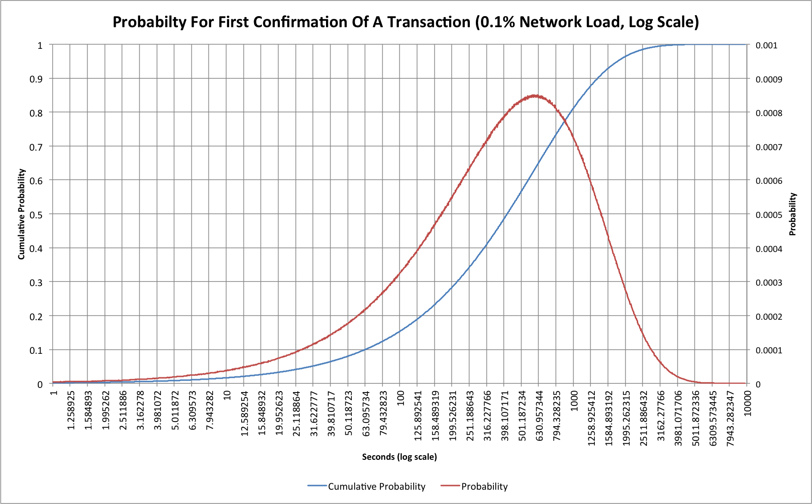
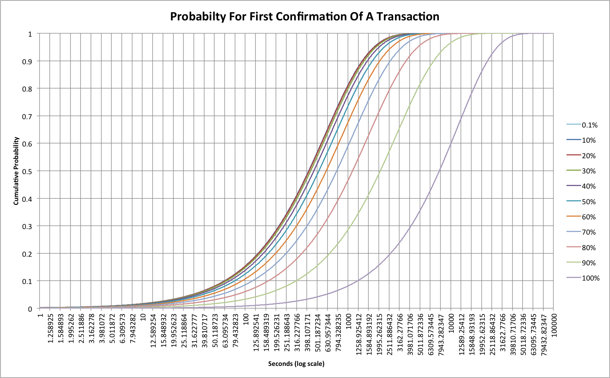

***Note 2015-12-20:***  This article is the
original "Bitcoin traffic bulletin" but has a minor problem with some
of the probability statistics.  A revised, authoritative, version with
significantly updated commentary can be found as "[Bitcoin traffic
bulletin (redux)]()".
Please read that one; this one is retained purely for historical
information!

---

The Bitcoin network is currently running at around 30% of its maximum
capacity, but what does that actually mean to its users?  Should we care?
What about when we reach 50%, or 90%?  When roads start to get full of
cars they start to get congested, when large numbers of visitors enter
or exit a building everyone slows down and takes longer to set where
they want, but what happens with Bitcoin?

## Bitcoin transaction processing

Bitcoin mining (and therefore transaction processing) is what's known
as a Non-Homogenous (or Inhomogeneous) Poisson Process.  In the article,
"[Hash rate headaches]()",
we saw how this actually works and that our nominal 10 minute spacing
between Bitcoin blocks isn't quite as straightforward as we might hope.
For transaction processing though things get even more complicated.  Now
we have transactions that themselves appear somewhat randomly; in fact
they will typically follow something like a Poisson Process distribution
too.

In the case of Bitcoin the transactions do have some other biases.  We
saw in "[7 transactions per second?  Really?]()"
that Sundays are usually quieter than other days, while Bitcoin
transactions can also be perturbed by network delays, orphan races and
mining fees that might incentivize some transactions to be processed
quicker than others.  None of those effects really come into play though
when we have a very small number of transactions so we could actually
model the behaviour and see what happens.

In "[7 transactions per second?  Really?]()"
we saw that the current Bitcoin network has a peak capacity of a little
under 3.5 transactions per second (arguably closer to 3.2 at times).  We
can use that information to build a Monte Carlo simulation that will
predict how long it takes to get transactions confirmed.

## Monte Carlo simulation

For the purposes of this article I constructed just such a Monte Carlo
simulation that assumed a peak of 3.5 TPS and that would simulate a
mining Poisson Process with a mean block finding time of 10 minutes and
a transaction arrival Poisson Process with a mean that was given by a
percentage network load.  For example a 10% load would be 0.35 TPS, or
30,240 transactions per day.  In order to get good data the simulation
was set to run 100,000 weeks of mining at 11 different loading levels.
Each week started from scratch and with zero transactions pending.

The simulator ignores mining fees and assumed that transactions are
processed first-come, first-served; this actually turns out to be a
reasonably accurate prediction for most current transactions.  It also
ignores network propagation delays (how long it takes for a transaction
to be seen by all mining nodes) but that will really just add a fairly
small starting delay of up to a few seconds per transaction and so this
is probably ok too (see:
[http://bitcoinstats.com/network/propagation](http://bitcoinstats.com/network/propagation/)).
It does mean that the data is probably a little too optimistic about how
quickly transactions can be mined.  Finally it assumes that the mining
network capacity is constant and neither increasing, nor decreasing in
capacity.  When things are increasing then blocks will be found slightly
quicker, but the effect has become quite small over the last few months.

Let's start by looking at what happens when there are almost no
transactions being announced.  This should represent an almost perfect
scenario because every transaction can immediately go into the next
available block.  The network load for this example is 0.1%, or 0.0035
TPS.

We have two traces here.  The red trace shows the probability of a
transaction being confirmed at a given time after it was submitted,
while the blue trace shows the cumulative probability; i.e.  the
probability that a transaction will have received its first confirmation
at or before a given time.

We can see that 50% of transactions are confirmed within 415 seconds (a
little under 7 minutes).  Equally though, 10% have not had their first
confirmation after 1380 second (23 minutes), and 1% are still
unconfirmed after 2760 minutes (46 minutes).  This may come as a surprise
to people, but no amount of fee changes, or network improvements will
change these basic numbers!

In the past we've tended to make use of graphs plotted on a logarithmic
axis and these ones are no exception!  Here's the same graph with a
logarithmic time (horizontal) axis:

The logarithmic scale compresses the "tail" to the right so we can
compare things more easily later.  The cumulative probability curve looks
different too, and is somewhat easier to work with on this sort of
scale.

## What happens with more loading?

Things become much more interesting when we start to consider some
reasonable loading on the network.  As of early November 2014 the network
load is around 30%.  If we use the simple Monte Carlo simulation we can
model this pretty easily.

Let's look at network loading from 0.1% all the way to 100%:

Probably the first thing to realize here is that the traces for 0.1%,
10% and 20% are so similar that the 20% line hides the other two.  The
30% line is only slightly different.  This tells us that up to now we've
not really seen any real effects as a result of transaction rate.  At 30%
loading we'll still see half of all transactions confirmed within 434
seconds, as opposed to 415 for 0.1%.  That gap really starts to widen at
40%, however, where it now takes 466 seconds and at 80% we're up at
1109 seconds (18.5 minutes)!  At 100% we're up at a huge 7744 seconds
(more than 2 hours)!  If the network were ever to reach this 100% level,
though, the problems would be much worse as 10% of all transactions
would still not have received a confirmation after 22800 seconds (6.3
hours).

## Mining fees will save us?

The simulations are pretty simplistic because they assume all
transactions are processed in the order they arrive.  There's no attempt
to simulate the effect of fees, but the first thing to recognize is that
the 0.1% loading case (and indeed almost everything up to 30%) pretty
much wouldn't care anyway.  In these situations there's little to no
congestion so fee-base reordering of transactions won't make any real
difference.  As the network gets congested though then fees can start to
have an impact.

Once we start to see full blocks (and we have been starting to see these
in the last few weeks) then fees should decide whether a transaction is
in the next block or may be delayed to one after that.  Statistically
that will mean that blocks with higher fees, or that for other reasons
are deemed to have high value to the network, will follow curves closer
to those for a lightly loaded system as we've seen so far.  It also
means that those with low fees will actually see even worse delays than
the simple model predicts.

No matter how much the fee structures are changed, however, unless the
speed of finding blocks is increased then we're pretty-much stuck with
the characteristics that have been present for the last 5+ years.  For
example, the "floating fees" change coming in the new Bitcoin Core
software won't improve anyone's confirmation times beyond a few
seconds, but fee-based prioritization will allow anyone willing to pay
to keep their current confirmation behaviour.  Similarly making the
blocks larger won't improve confirmation times other than by moving us
to the curves for a less congested network.

## Rewards for a Bitcoin miner?

While less than ideal for users of Bitcoin, congestion of the network
does have a potentially positive impact for one group: Miners.  As block
space becomes scarce, users of the network will have to attach larger
fees to continue to see confirmation times of the order they are used
to.  When fees increase then miners reap the reward.

When block space is readily available, miners suffer from a "tragedy of
the commons" problem in which the only rational behaviour is to accept
all transactions, no matter how small the fee.  With scarcity, however,
there's suddenly a competitive market for block space.  Those paying
fees may not appreciate the extra costs, but a transition to a system
that allows mining fees to become a larger fraction of mining income is
actually a good thing for the long term security of the network.
Increased fees would go some way to offsetting the losses that miners
will see at the next block reward halving to 12.5 BTC per block in 2016.

## Consequences

If the network becomes more congested and fees increase then this will
inevitably have an interesting impact on "spam" or low value
transactions.  They may well start to find themselves priced out of the
blockchain.  This may well also be a trigger for the use of something
like sidechains.

One thing is clear though!  Anyone looking closely at transactions on the
network can probably see the signs of those tail lights coming on ahead.
Unless something happens quickly, it looks like we're going to be
slowing down pretty soon.

---

## Source Code

This article was written with the help of data from a C language
simulation.  The data was rendered into charts using Excel.  The source
code can be found on
github: <https://github.com/hashingitcom/bitcoin_traffic_bulletin>

---

## Related articles

- [7 transactions per second?  Really? (2014-11-02)]()
- [Finding 2016 blocks (2014-06-15)]()
- [Hash rate headaches]()
