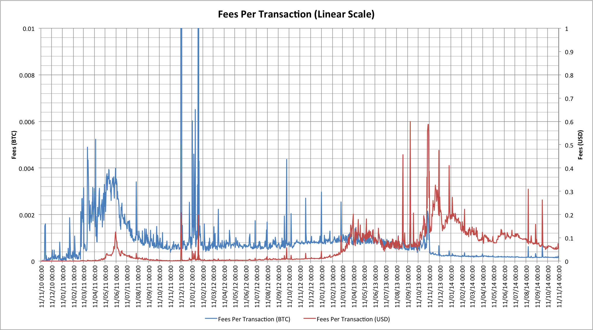
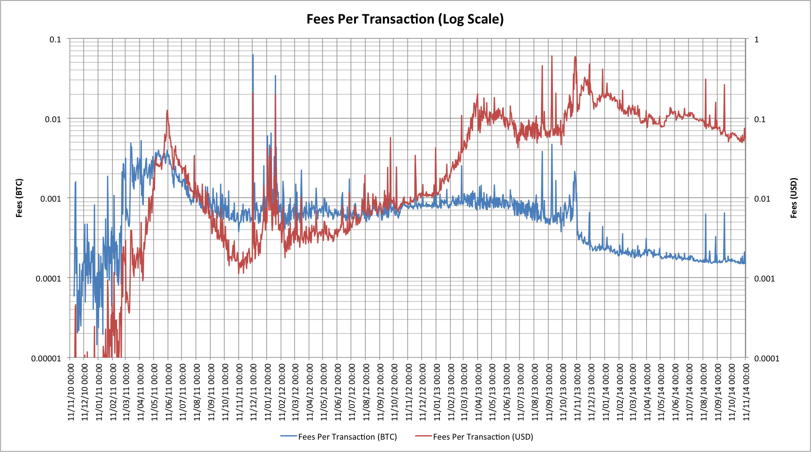
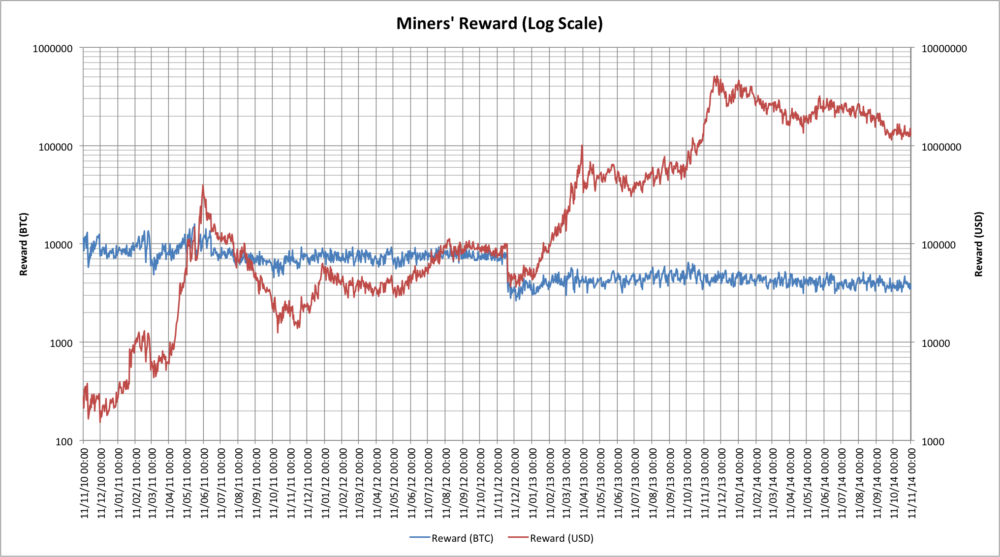
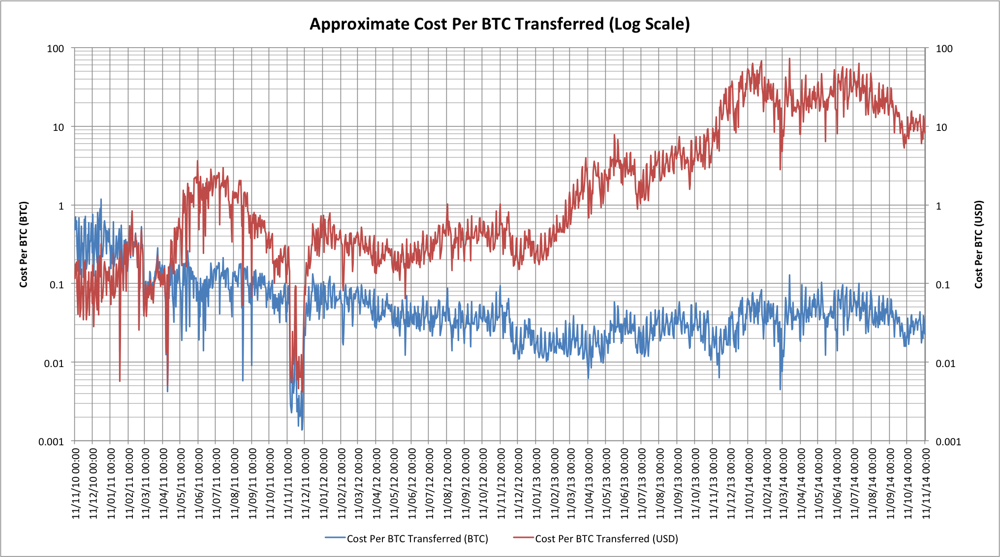

Bitcoin is often touted as having substantially lower fees associated
with using it than most other financial systems, but fees and costs are
very different things.  The reality of things in the Bitcoin ecosystem is
rarely simple, and this one is no exception.  What then are the actual
numbers, where are they heading and what are the consequences?

## Transaction fees

Probably the biggest challenge in looking at the costs of transactions
is to work out what that actually means.  For anyone sending BTC the
obvious "cost" is the transaction fee, so let's look at that:

## 

This data, as with all of the data in this article, comes from
[blockchain.info](http://blockchain.info).  The chart shows the fee per
transaction for the last 4 years, and shows that that cost is in BTC and
what that converted to in USD. The USD trace is really hard to follow early
on though so let's look at this on a logarithmic scale:

Certainly these numbers would appear to back up the claim that Bitcoin
transactions are really inexpensive!  BTC-denominated fees have actually
steadily fallen for most of the last 4 years and are now at about
0.00015 BTC per transaction.  As long as we're talking about
transactions involving, say, 0.1 BTC then the fees have pretty-much
always been less than 1%, and are now more like 0.15%!

This is where things start to become a little interesting though.  The
fee is primarily concerned with ensuring a minimum charge to avoid the
network relaying "dust" transactions of tiny amounts, and also
charging an amount per kbyte of data required to store the transaction
in the blockchain.  What the fee doesn't take into account at all is the
BTC value being transferred.

The fee structure means that BTC transfers are incredibly inexpensive
for large transactions, but that small transfers can become much more
expensive.  As we've seen before in "[7 transactions per second?  Really?]()",
there's actually a hard limit on transaction space and the current mean
transaction size limits the network to less than 3.5 transactions per
second so the fee structure is designed to prevent people from consuming
too much block space with low-value transactions (if anyone wants to do
micropayments then they really need to aggregate them together).

The transaction rate limit also has an impact on the speed with which
the network confirms transactions.  With more transactions the network
becomes congested and confirmation times increase.  The only way to avoid
increased confirmation times will be to incentivize miners to mine
specific transactions, and the only way to do that is to add a larger
fee to a transaction.  If the network starts to become congested then one
natural consequence is that fees will start to increase too.

## Rewards for Bitcoin miners

The observation that fees are likely to increase may upset some users of
the Bitcoin network, but is good news for the people actually doing the
transaction processing: Bitcoin miners.

Let's look at things from the perspective of a miner:

The red line showing the amount of money received by miners in USD looks
impressive.  Even with the decline in BTC price to late October the daily
revenue for Bitcoin miners was at over \$1.5M per day, but that revenue
is paying for the installation and running of mining hardware.  If we
guess that the average mining server is about 1.5 TH/s and the current
network capacity is around 270 PH/s then that would suggest at least
180,000 mining units worldwide!  In reality there are probably in excess
of 200,000.

The 25 BTC reward for each block over the last 2 years has enabled
industrial scale mining that was initially very profitable for miners
and their suppliers, but has rapidly followed the same trends as other
sorts of industrialized mining and has reached a point where the costs
associated with mining almost consume the reward from selling what was
mined. Bitcoin mining has been heavily squeezed as a segment, especially
with the decline in the USD price of Bitcoin during 2014.  The USD price
(or other fiat currency conversion rates) is critically important
because development, equipment manufacturing, hosting, and power are
almost entirely paid for in fiat currency.

The blue line shows the problem though.  This one is the BTC-denominated
reward for miners and it's pretty obvious that most of the reward
isn't changing.  Until late 2012 that was 50 BTC per block mined and
then subsequently 25 BTC.  In 2016 this will drop to 12.5 BTC and that
should be a concern to Bitcoin users too.  If we're very observant we
notice that this blue trend is actually moving slightly down right now;
as the network expansion slows then fewer blocks are mined each day (we
get closer to 144 per day).  The other thing that is clear from the blue
trend is that transaction fees are currently almost inconsequential to
the viability of mining operations.  The total fees paid in a day are far
less than even a single block reward.

## Block reward halving

We might look back at the reward halving in 2012 and observe that there
wasn't much of a problem back then so why might there be in 2016, but
in 2012 things worked out surprisingly well for the network.  The
USD-denominated Bitcoin price doubled within a couple of months, while
mining was not operating on the sorts of low margins that are common in
2014.  In 2016, unless there's a fortuitous price spike again, or
without some additional source of revenue, industrialized mining will be
placed under extreme pressures.

Advocates of decentralization may like to think that this as a good
thing, but there are two notable problems:

- If 50% of the network were to be unplugged then the amount of
  security for the network would drop by 50% and that would in turn
  risk an attack from that now "dark" hardware.  51% wouldn't be a
  just a theoretical problem anymore, there would be hardware sitting
  idle and able to launch just such an attack.
- Smaller miners would feel the economic pinch much sooner than the
  larger miners.  The largest operations almost invariably have better
  economies of scale and can probably weather the loss of income
  better.  Our 50% sized network would now almost certainly end up in
  the hands of even fewer industrial miners.

One potential way to offset the reward change and keep miners
incentivised would be to increase the transaction fees.  If the network
were to move to being funded largely by fees rather than block rewards
then the risks associated with block reward halving could be
dramatically reduced.

## What do transactions really cost?

To understand how fees might become a significant incentive for miners
we need to understand what the costs of transactions look like in terms
of the current mining rewards.  There are a couple of ways we can think
about this.

Let's start with the obvious one: What is the cost to the whole network
for an average transaction?

With this measure each transaction costs around 0.045 BTC, or
approximately \$17 at the end of October 2014.  The network is able to
process more transactions per second than it is right now.  It's
currently running at about 30% of its capacity and has doubled in the
last 12 months.  If we presume that at the next reward halving we're at
60% of the capacity then we'll have twice as many transactions and thus
the cost per transaction would be half of our current estimate: i.e.
0.0225 BTC.  In addition our block reward isn't going away completely,
it's just halving, so we'd need fees to make up a shortfall of 0.01125
BTC per transaction.

## Another approach?

It seems pretty unrealistic to expect fees of that magnitude based on
the current scheme for setting fee levels so perhaps we need to consider
some other data.  Let's look at the transaction cost per Bitcoin.  This
is a little tricky because transactions don't always make it easy to
determine if a transaction output is going to someone else or is simply
change being returned to the sender.  Blockchain.info's data does
attempt to estimate the actual transaction volume though so we can try
to use that here:

The current cost to the network is approximately 0.03 BTC per BTC
transferred.  If we were to see a doubling in transaction volumes as
predicted earlier, and the transaction value therefore doubled, then the
cost would drop to 0.015 BTC per BTC transferred.  As a result if miners
were to be given a fee of 0.0075 BTC per BTC transferred then that would
offset the losses at the next block reward halving.  The real question is
whether a 0.75% transaction fee is something that the network is
prepared to accept in order to preserve its security?

Of course this isn't the only way in which this particular problem
might be averted, but one thing is clear: there will inevitably have to
be changes to way in which mining is funded in order to keep things
running smoothly. 

\[Data reference: [blockchain.info](http://blockchain.info)\]

------------------------------------------------------------------------

## Related articles

- [Bitcoin traffic bulletin (2014-11-11)]()
- [7 transactions per second?  Really? (2014-11-02)]()
- [The rewards for a Bitcoin miner (2014-04-03)]()
