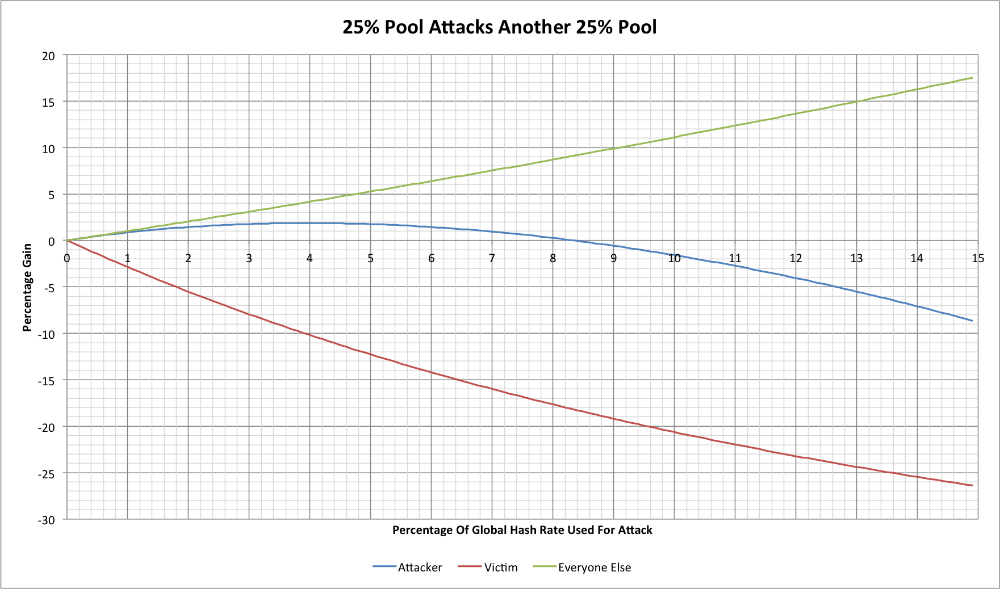
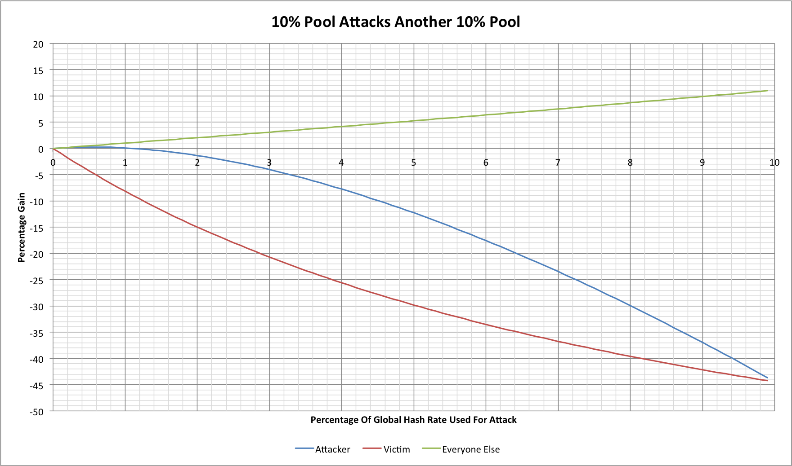
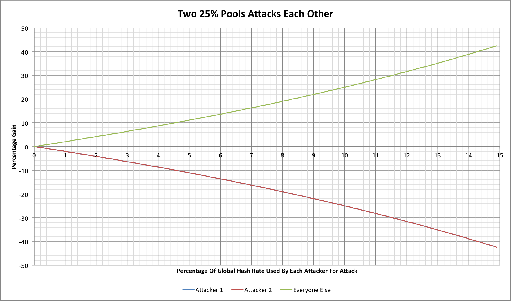
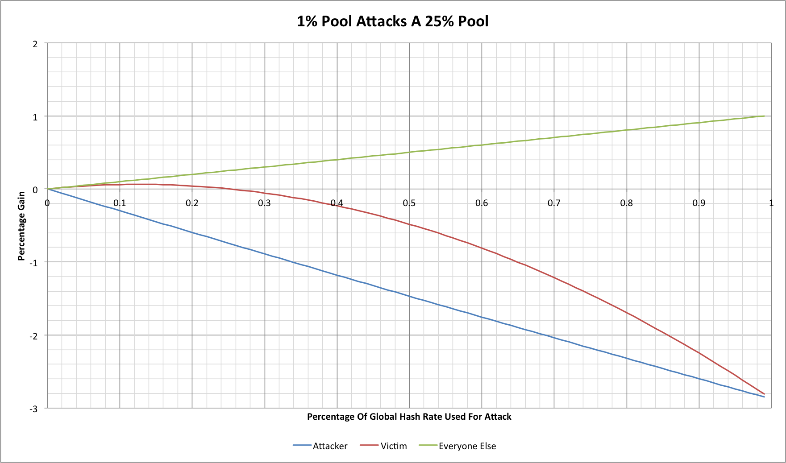
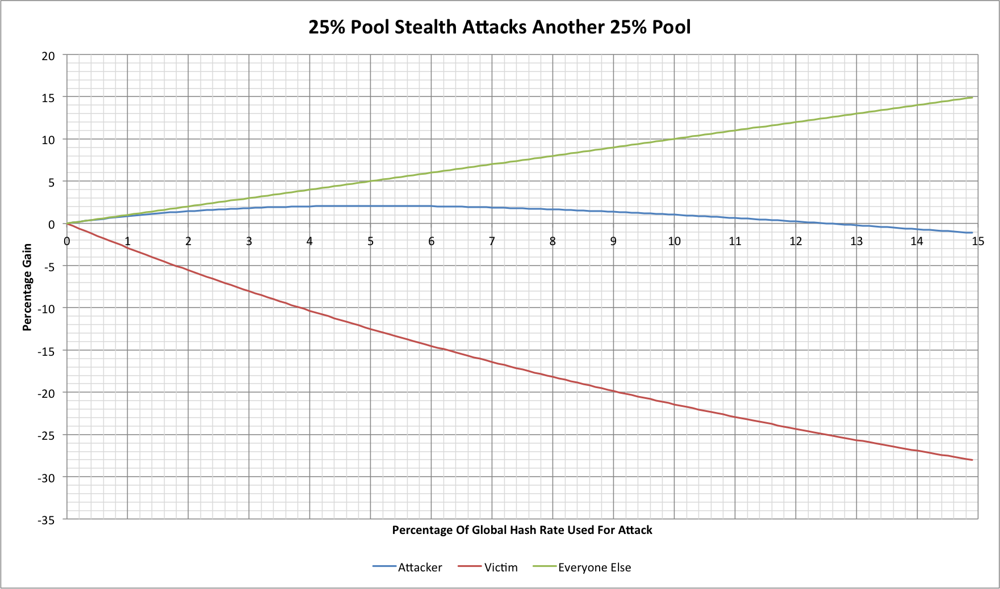

An intriguiging paper, "[The Miner's Dilemma](http://hackingdistributed.com/2014/12/03/the-miners-dilemma/)"
was published a few days ago by Ittay Eyal.  It describes an attack by
which an open mining pool may be attacked using block withholding.  Given
that most Bitcoin mining is managed by open mining pools then it seems
like it ought to raise a few eyebrows (perhaps more than it has
already).  Just how does this attack work though, who wins, who loses and
by how much?

## Mining pools

Before we can really talk about winners and losers we really need to
take a simple look at how mining pools pay out to their miners.

A mining pool needs to use a way to have its contributors demonstrate
that they've been working to find Bitcoin blocks.  Given that Bitcoin is
designed as a trustless system this isn't a trivial problem.  The
approach that is taken is to have miners submit "shares" where a share
is defined to be a proof-of-work solution towards the Bitcoin block that
the pool is trying to find but that doesn't necessarily meet the
difficulty requirement for a full Bitcoin block.  Shares that don't meet
the Bitcoin network's difficulty aren't actually useful (there's no
concept of incrementally building a viable solution) but can be used to
estimate how much work each pool contributor has performed.

Say, for example, the Bitcoin network has a difficulty of 40B
(40,000,000,000) and we have a mining pool that has a nominal 1% of the
network.  On average the contributors to our pool will find one full
block 1.44 times per day (assuming the network isn't growing).  To work
out who is contributing what, our mining pool might take submissions
that are 100k (100,000) times less difficult (400,000 in this case).  Now
the pool would receive 144,000 submissions per day, of which, on
average, 1.44 would find full blocks for the pool.  If one miner
contributes, say, 1% of our pool's hashing capacity then that miner
will be responsible for a nominal 1440 shares per day.

Mining pools use a variety of different schemes to reward contributions
but most use some form of paying out rewards from any full Bitcoin block
that the pool finds, based on some proportion of the shares submitted
beforehand by its participants.  Let's assume that we're looking at a
reasonably simple case where the payout is proportionate to the number
of shares submitted since the pool last found a block (although the
logic works for other too).  Our pool, on average, finds a block 1.44
times per day and thus receives 100,000 shares inbetween blocks that it
finds, of which the last one is the solution to a block.  Our 1% miner
will have submitted 1000 of these shares and the pool will pay out a
proportionate amount of the mined block reward.  At its most simplistic
the pool might charge 0% fees but, say, keep the transaction fees, so if
the block reward is 25 BTC then our 1% miner receives a nominal 0.25 BTC
every time the pool finds a block; 0.36 BTC per day.

To the miner this is a far more consistent reward than the one block
every 69.4 days that they might hope to achieve on average mining on
their own, and carries a much lower variance in terms of potential
returns.

We should note that all of the above is a simplifcation becuase mining
is a Non-Homogeneous Poisson Process and as such all of the numbers are
mean values.  For example our miner may end up submitting 1050 shares for
one block and 950 for the next and 1000 for the one after that; it
won't be a consistent 1000 for each.

## Block withholding

Block withholding is a scenario in which a miner submits valid
lower-difficulty shares but does not submit shares that match full
Bitcoin blocks.  If they do this then they still receive a proportion of
anything else that the pool earns but prevent the pool from claiming the
reward for any blocks that they should have contributed.  In the case of
our hypothetical 1% miner again and pool, they would reduce the pool's
income by 1% but would still continue to gain 1% of what the pool did
earn.  The miner would have harmed the pool by a small amount at a much
lower impact to their own returns.  The withholding miner does not get to
keep the block as pools protect against this!

Intuitively this seems like it would be a bad idea for the miner
withholding blocks unless they simply wished to attack the pool.  Eyal's
paper shows that this isn't necessarily the case.

Let's consider a large-scale example.  Imagine that we have a pool with
25% of the network hash rate and it wishes to attack another open pool
that has 25% of the network:

The vertical axis shows the percentage gains that the various
participants in the network will see above what they would have seen if
no-one was conducting an attack.  The horizontal axis shows the
percentage of the total network hash rate allocated to the attack.  In
this case the maximum value would be 25% as that is the total available
to the attacker.

There are some very striking trends!  First the biggest winners in any
such attack are the neutral third parties.  The attack removes hashing
from the network and so everyone else finds more of the blocks (albeit
more slowly until after the next difficulty change reduces the
difficulty).  The more intriguing aspect is that the attacker also gains
financially!  At up to 4% of the network hash rate (approximately 16% of
the pool's capacity) the attacker achieves a 1.87% increase in their
total revenue.  At that same 4%, however, our victim has lost 10.2% of
their revenue meaning that this has significantly harmed the other
miners in the victim pool.

There is an interesting quirk in all of this as regards the operator of
the victim pool.  If they mine within their own pool then they will also
suffer losses from the attack, but if they don't then they may actually
see increased income too!  The attacker reduces their own hash rate and
so the victim pool is actually going to find a larger percentage of the
total blocks.  In the example above, if the attacker shifts 4% of the
total network hash rate to the attack then the victim pool's original
25% is now 26.04% of the network and thus sees a total revenue increase
of 4.17%.  A pool operator who takes a percentage of mined rewards or
takes the transaction fees will actually see a 4.17% increase in their
own income even as the victim miners see a significant reduction in
theirs.

## Smaller scale?

We might now ask what happens if our pools are smaller.  Say our attacker
has 10% of the network hash rate and our victim has 10%:

The curves are similar, they're just scaled down.  In fact the attacker
has less scope to win, achieving a maximum gain of 0.28% when deploying
0.55% of the global hash rate during the attack (approximately 5.5% of
the pool's capacity).  Conversely though the losses to the victim
accumulate faster because a fixed amount of hash rate targetted towards
it represents a proportionately larger fraction of the pool's capacity.

If we consider two pools each of which have 1% of the global hashing
capacity then things scale even further.  There is still a tiny margin
for an attacker to see a positive reward but it is only at 0.005% of the
global hash rate (approximately 0.5% of the pool's capacity).  It's
clear that the nominal rewards from this style of attack scale
dramatically in percentage terms as the attacker and victim hold larger
percentages of the total network capacity.

## Scaling effects (part 1)

The scaling effects we've just considered may seem surprising, but a
little thought reveals that they are not.  The attacker wins by gaining a
larger share of the victim pool's revenue and at the same time causes
the victim pool to actually still generate more revenue.  If the amount
of hashing involved in an attack is small, however, then the attacker's
switched hashing doesn't affect the global hash rate by very much.  The
larger the attack, the larger the effect.  This has other implications
that we will return to later.

## Mutually assured destruction?

If one party can attack another then surely the victim might retaliate?
There are some wrinkles to this but for now let's just consider that.
Here are our original two 25% sized protagonists withholding blocks from
each other in similar proportions:

Attacker 1 isn't off the chart here, they're just on the same trend
line as our previous victim, now "Attacker 2".  Now it's clear that
"Everyone Else" would sit back and enjoy the fight.  The more the two
antogonists contribute to the fight the quicker both lose!

We might assume that the attackers could simply try to harm everyone
else too, but the attack only works against open mining pools in which
participants can sign up and contribute shares without an element of
trust between the mining pool operator and the miners who contribute
shares.  This is the wrinkle noted above; if our attacker has 25% of the
hash rate but operates a private/closed mining pool then the victim
cannot retaliate.  If the "Everyone Else" capacity is found in closed
mining pools then they cannot be victims of this type of attack either.

## Big vs little?

We've seen two large pools involved, but what happens with a large
attacker and a small open pool?

There is a very small period here where the attacker makes a slight
gain, but it quickly dissipates.  At the point where 0.33% of the global
hash rate has been used (1.33% of the pool's total) the attacker is no
longer gaining, but the victim pool's miners sees a 25% reduction in
revenue.  At that sort of loss in revenue it would be likely that miners
would start seeking other ways to mine more profitably.

## Little vs big?

If this works one way round then can it work the other way round?

Clearly the answer is yes a small attacker can still gain a small amount
at the expense of a large victim!  It's worth noting though that in
order to do this they must use 12.7% of their total hashing capacity to
achieve the largest gain and that the gain in question probably isn't
sufficient to be worthwhile.

## Scaling effects (part 2)

So far what we've seen is that large attackers and large victims result
in big gains for attackers and that attackers not operating in open
pools cannot be victims of retaliation.  We've also seen that small
pools can certainly suffer at the hands of large ones but not in ways
that are directly profitable to larger pools (other than damaging
competitors).  It might seem that this is a clear win for small mining
pools, but let's not get too hasty!  There are (at least) 2 problems:

- Small mining pools suffer from significanly worse reward variances
  as we've seen before in, "[The gambler's guide to Bitcoin mining](
- [The gambler's guide ro Bitcoin mining (2014-06-30)]()
)".
- The block withholding attack scales up by attacking multiple pools!

Let's consider 2 victim mining pools with 12.5% of the total hash rate
each, and an attacker that has 25%.  Now if our attacker targets each
with 2% of the global hash rate then the effects are identical to using
4% to attack one pool with 25% of the total hash rate.  Similarly
attacking 25 pools with 1% of the global hash rate each and targetting
0.16% at each has the same effect.  In fact if an attacker has a
reasonable estimate for the hash rate of potential victims then an
attack can be made, proportionate to each one's size.

There is a potential problem for would-be attackers though.  If two
attackers target the same victim with a large enough combined attack
then they will actually push the potential gains into negative territory
for both of them.

## Countermeasures?

The only real way to prevent an attacker or group of attackers from
being able to gain from this sort of attack would be to reduce the
mining rewards paid by pools for shares rather than for actual full
blocks.

In the case of a 10% pool attacking another 10% pool we would require
that shares be paid no more than 90% of the total mined reward in order
to prevent an attacker from gaining.  In the case of a 25% pool attacking
another 25% pool then the share-only reward would have to be no more
than 75% of the total mined reward while a 40% pool attacking another
40% pool would require that share-only rewards be 60% or less of the
total earned.

As we've seen before, though, the problem is that this attack scales
so attacking 25 pools of 1% size is the same as attacking one of 25%;
the pools couldn't set share payout levels that reduced the vast
majority of miners' payouts by 25%, even though a few lucky miners
would gain far more for finding full blocks.

## Bring on the stealth weapons

In the scenarios we have considered so far our attacker transfers some
of their hashing capacity from mining to attacking so that hashing
capacity ceases to find blocks that are declared to the rest of the
network.  With very large pools the loss in hash rate should at least
raise some eyebrows, especially if the same hashing capacity didn't
reappear somewhere else.  With this said, however, statistical variance
would certainly mask some of this.

An alternative, however, would be for an attacker to deploy "stealth"
hashing.  This is hashing capacity that has never been used for
conventional mining but is brought online solely to attack open pools.
As this capacity would never have contributed to hash rate statistics
then it won't be noticed by anyone, potentially including the victim
pool, because it can be targetted in small chunks of a few TH/s each.

Let's see what this might look like:

Consider a case where our attacker adds 5% of the useful global hash
rate for the purpose of attacks.  They now control 28.6% of the total
hash rate (their new 5% dilutes their old 25%) but are achieving 2.08%
more than their 28.6% would normally achieve.  The victim pool (or pools)
loses 12.5%, however!  Our attacker knows that they have gained but
no-one else is any the wiser, while our victim appears to be suffering
from bad luck, and it could take months to statistically demonstrate
that this wasn't just bad luck in any meaningful way.  No external
observers would be any the wiser unless the victim pool publishes its
share data for analysis (which most pools would probably not wish to do
for privacy reasons).

## More than just a theory?

Are we actually seeing this style of attack on mining pools already?
Realistically unless someone published verifiable details of what they
had done then it's probably impossible to tell.  Have we seen
large-scale attacks, perhaps not, but as with so many other Bitcoin
network statistics there's a lot of room for things to hide!

------------------------------------------------------------------------

## Source code

This article was written with the help of data from a C language
simulation.  The data was rendered into charts using Excel.  The source
code can be found on github: <https://github.com/hashingitcom/pool_wars>

------------------------------------------------------------------------

## Related articles

- [The gambler's guide ro Bitcoin mining (2014-06-30)]()
- [The rewards for a Bitcoin miner (2014-04-03)]()
