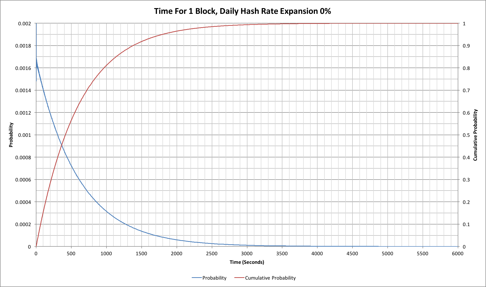
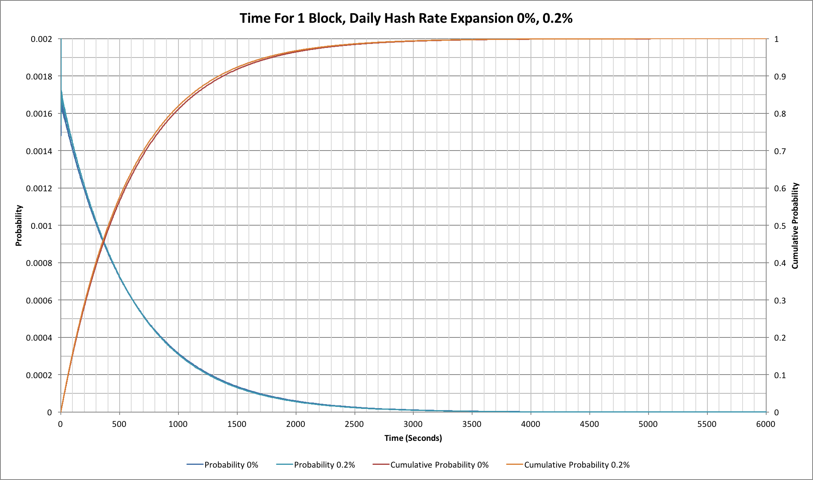
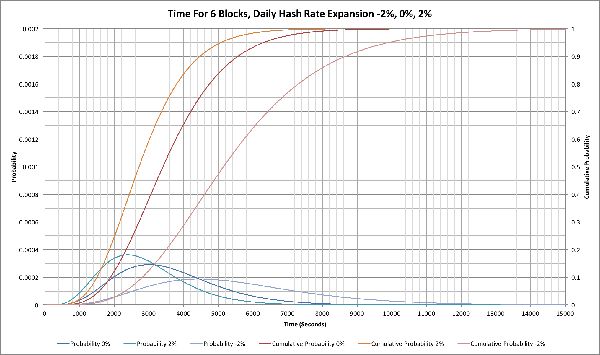

Bitcoin blocks take 10 minutes to find don't they? Well, actually no
they don't. Sometimes they can be found really quickly, but other times
they can take a very long time. Just to make things confusing, the gaps
between blocks can change depending on whether the hashing network is
stable, expanding or contracting. What if we need 6 blocks (to get 6
confirmations)?

So what should we expect? What happens during hashing growth phases, and
what would happen if the network were to lose large amounts of hashing
capacity?

## Note

This article is a revised version of an earlier one, "[Waiting For Blocks](index.php?option=com_content&view=article&id=41:waiting-for-blocks&catid=8:analysis&Itemid=110)".
Unfortunately, in that article, some of the probability data wasn't
presented in the right form and this affected a few minor parts of the
commentary. This revision contains updated charts and also updated
commentary!

------------------------------------------------------------------------

## Running like clockwork?

In a somewhat perfect world we might hope that our nominal 10 minute gap
between blocks would be exactly 10 minutes, but anyone who has ever
watched block arrival times will know that that's not what happens:

The blue probability line shows the incremental probability of finding a
block at a given time. This might seem a little strange until we look at
the red, cumulative probability, line. The cumulative probability
indicates how likely it is that we already found a block by a given
time, so the blue line makes more sense. As time progresses it's more
and more likely that we already found a block so the number that will be
found after a long time reduces significantly.

In the Bitcoin network our mean block finding time is 10 minutes, but by
the time we reach 10 minutes there's a better than 63% probability that
we've found a new block, not 50%. In fact 50% of blocks have been found
within 415 seconds (just under 7 minutes).

The 37% of the blocks, that take longer than 10 minutes, can take a very
long time to find! At an hour we've still not found a block a little
less than 0.25% of the time; that means that typically 1 block in 401
will take more than an hour to find! There are a few subtleties to this
particular number but we'll come back to those in a little while.

If, like me, you find the 1 in 401 number was something of a surprise
(that's about once every 2.8 days on average) then it's perhaps worth
looking at some gaps between blocks. In the 12 day period up to
2015-02-05 (when the original article was written) I quickly located 5
blocks that took more than an hour to find!  (the number might be higher
as I was doing this manually by checking a blockchain explorer). For the
record these were 340450 (77 mins), 340521 (63 mins), 340544 (67 mins),
341727 (60 mins) and 342002 (72 mins). Three of these occurred in a
single 24 hour period over the 25th and 26th of January.

## 6 confirmations?

If a single block can take so long to find, what about the 6 blocks that
we need for many simple Bitcoin clients (SPV wallets)?

We'd certainly expect that things will be closer to our anticipated 10
minutes per block and that is indeed the case. 50% of the time we've
found 6 blocks by 3400 seconds (a little under 57 minutes). At 60
minutes we've found about 55% of blocks. A surprise, however, is that
in 10% of cases it takes more than 5560 seconds (more than 1 hour, 32
minutes) to find 6 blocks; in 1% of cases it takes more than 7870
seconds (2 hours, 11 minutes)! On the flip side of this though, in 10%
of cases we get all 6 blocks within 1890 seconds (a little under 32
minutes) and in 1% of cases we have all 6 within 1070 seconds (just
under 18 minutes).

## The network isn't static!

So far none of the results we've seen should come as anything of a
shock to anyone who understands the statistics assoicated with a Poisson
process. The real Bitcoin network is somewhat more subtle though because
it is really a non-homegeneous Poisson process; underlying hashing
capacities change throughout each difficulty period of 2016 blocks. If
we start out at, say, 300 PH/s but add 0.2% new capacity every day, then
after 14 days (a little more than the 2016 blocks take) we'd have 308.5
PH/s. That means that towards the end of the 2016 blocks we're actually
going to see blocks found more quickly than at the start. In addition,
as we saw in "[Lies, Damned Lies And Bitcoin Difficulties](index.php?option=com_content&view=article&id=29:lies-damned-lies-and-bitcoin-difficulties&catid=8:analysis&Itemid=110)",
the nominal hash rate calculated at the end of each difficulty period
lags about a week behind the current hash rate.

The 0.2% increase per day isn't a completely random number; it's a
good approximation to the underlying trend for the last couple of
months. Comparing this and the "ideal" numbers where there's no
change in the network's hash rate we can see the following:

The difference isn't all that great. Our mean block finding time is
closer to 9 minutes 45 seconds, while our mean time to see a block take
an hour or longer increases to once every 480 blocks.

## What about more extreme changes in hash rate?

A hash rate increase of 0.2% per day doesn't have much effect, but what
about 2% per day? 2% seems like a huge number based on recent months,
but was quite common in the earlier part of 2014. At the same time as
considering postive increases it seems worth considering negative
changes too.

A +2% per day change corresponds to a nominal 24.8% increase in hash
rate over 2016 blocks and takes about 11.2 days. The rapid increase
causes us to find blocks very quicky and thus readjust the difficulty
quickly. A -2% per day change has a much larger impact, however, because
our 2016 blocks end up taking nearer to 21 days. This would correspond
to a hash rate reduction of 34.6%.

The following curves assume a steady state change, i.e. what would
happen if we'd been seeing a steady +2%, 0% or -2% change in the
previous difficulty period too. As such these are more extreme that we
would see in the first difficulty period for which the change was
occuring; they do match a second or subsequent period:

During our +2% expansion we see a mean block time closer to 8 minutes,
but with a -2% contraction the mean moves closer to 15 minutes!

Now let's look at the same behaviour for our 6 confirmations:

As we might expect, the pattern for a single block is mirrored for 6
blocks.

## Final thoughts

The Bitcoin design is suprisingly well adjusted for a network in which
hash rates are expanding. Given that technologies continually improve
then that's probably the right bias as a normal schedule of replacing
older, less power efficient, hardware with newer, more power efficient
models will tend to see global hash rates increase.

On the surface it looks like it works much less well when we see steady
contraction of the global hash rate, but such contractions are much less
likely. In general miners will remove their least power effiicient
hardware from the network rather than their most efficient, so if the
BTC price reduces the impact on the hash rate is significantly dampened.

There is another interesting aspect to the reduced block finding rate.
One of the theories about the recent decline in the BTC price is that a
lot of the downward pressure comes from miners selling newly-mined
coins. If miners start to unplug hardware and the block finding rate
falls then some of this pressure will also reduce because fewer coins
will be being mined each day. Whether this actually happens or not may
be an interesting indicator of what might happen when the block reward
halves in 2016.

------------------------------------------------------------------------

## Source code

The source code for the simulation tool that generated the results for
this article can be found on github at: <https://github.com/hashingitcom/waiting_for_blocks>

------------------------------------------------------------------------

## Related articles

- [Lies, Damned Lies And Bitcoin Difficulties (2014-06-10)](index.php?option=com_content&view=article&id=29:lies-damned-lies-and-bitcoin-difficulties&catid=8:analysis&Itemid=110)
- [Reach For The Ear Defenders (2014-05-24)](index.php?option=com_content&view=article&id=28:reach-for-the-ear-defenders&catid=8:analysis&Itemid=110)
- [Hash Rate Headaches (2014-05-20)](index.php?option=com_content&view=article&id=27:hash-rate-headaches&catid=8:analysis&Itemid=110)
- 
