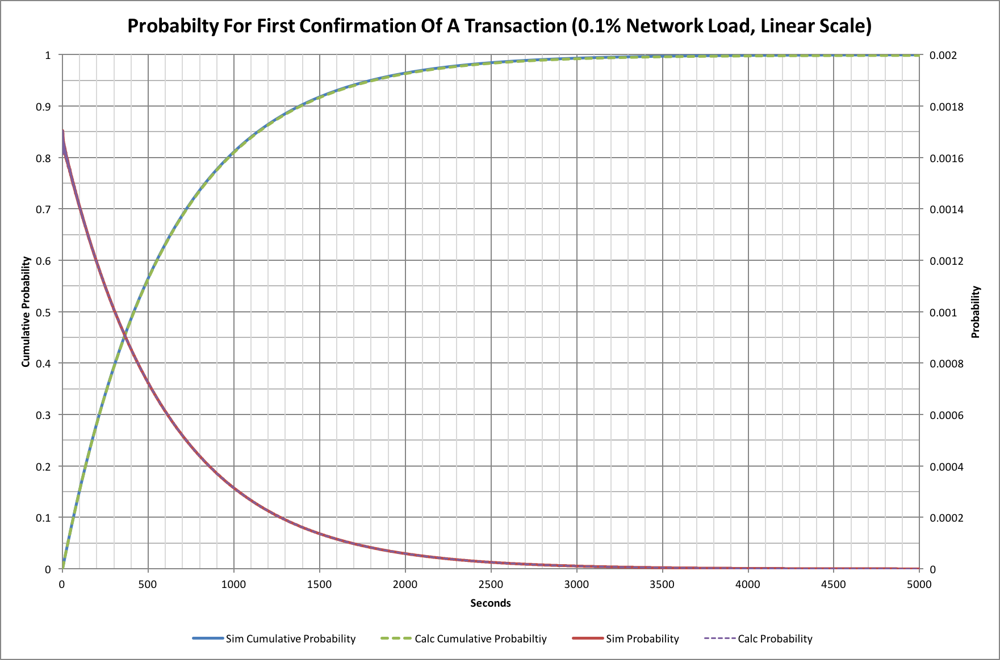
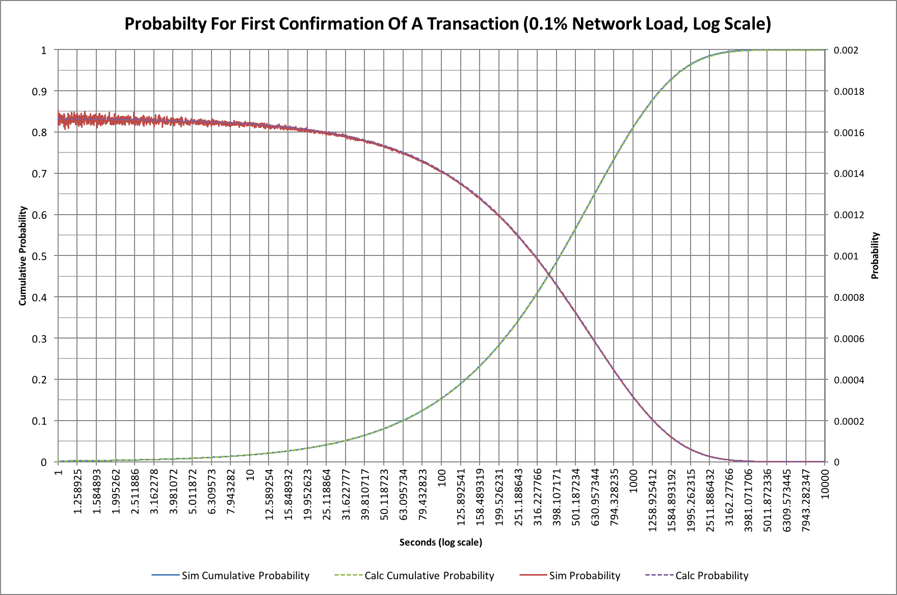
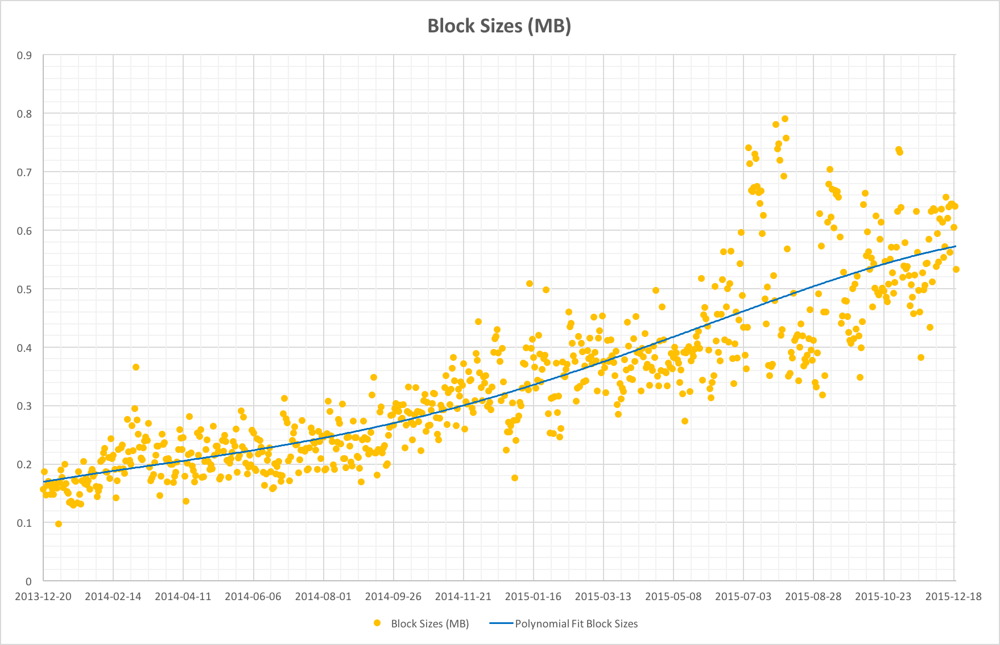

In November 2014 I wrote an article, \"[Bitcoin Traffic
Bulletin](index.php?option=com_content&view=article&id=34:bitcoin-traffic-bulletin&catid=8:analysis&Itemid=110)\"
that sought to look at what happens if the Bitcoin network started to
get congested. Since then there has been considerable debate about the
Bitcoin block size and there are now many proposals to increase block
capacity.

The original asked questions about what it would mean to reach, say, 50%
block capacity but events have moved on and we're at nearer to 60% at
the time of writing. It's probably a good time to review things once
more!

### Acknowledgement {#acknowledgement style="font-family: 'Helvetica Neue', Helvetica, Arial, sans-serif; color: #333333;"}

I'd been thinking about writing an updated version of the original
article for several months but didn't feel there was enough new data to
make it useful. A few days ago I was contacted by gandrewstone
(github.com user) who pointed out, quite correctly, that some of the
probability data in the original article was confusing. The data was
actually correct but really not that meaningful. My thanks go to him for
his observations. I updated the simulation (the patches can be seen on
github - see later), but in the course of reviewing things I also
realized there were interesting new findings to present.

------------------------------------------------------------------------

### Bitcoin Transaction Processing

Bitcoin mining (and therefore transaction processing) is what's known
as a Non-Homogenous (or Inhomogeneous) Poisson Process. In the article,
\"[Hash Rate
Headaches](index.php?option=com_content&view=article&id=27:hash-rate-headaches&catid=8:analysis&Itemid=110)\",
we saw how this actually works and that our nominal 10 minute spacing
between Bitcoin blocks isn't quite as straightforward as we might hope.
For transaction processing though things get even more complicated. Now,
as well as blocks, we have transactions that themselves appear somewhat
randomly; in fact they will typically follow something like an NH
Poisson Process distribution too.

In the case of Bitcoin the transactions do have some other biases. We
saw in \"[7 Transactions Per Second?
Really?](administrator/index.php?option=com_content&task=article.edit&id=33)\"
that Sundays are usually quieter than other days, while Bitcoin
transactions can also be perturbed by network delays, orphan races and
mining fees that might incentivize some transactions to be processed
quicker than others. We can also observe that transaction behaviour is
different at different times of the day too, depending on where the
transactions originate.

In \"[7 Transactions Per Second?
Really?](administrator/index.php?option=com_content&task=article.edit&id=33)\"
we saw that the current Bitcoin network has a peak capacity of a little
under 3.5 transactions per second (arguably closer to 3.2 at times). We
can use that information to build a Monte Carlo simulation that will
predict how long it takes to get transactions confirmed.

### Monte Carlo Simulation

For the purposes of this article I constructed just such a Monte Carlo
simulation that assumed a peak of 3.5 TPS and that would simulate a
mining Poisson Process with a mean block finding time of 10 minutes and
a transaction arrival Poisson Process with a mean that was given by a
percentage network load. For example a 10% load would be 0.35 TPS, or
30,240 transactions per day. In order to get good data the simulation
was set to run 100,000 weeks of mining at 11 different loading levels.
Each week started from scratch and with zero transactions pending.

The simulator ignores mining fees and assumed that transactions are
processed first-come, first-served; this actually turns out to be a
reasonably accurate prediction for most current transactions that
include a fee. It also ignores network propagation delays (how long it
takes for a transaction to be seen by all mining nodes) but that will
really just add a fairly small starting delay of up to a few seconds per
transaction and so this is probably ok too (see:
[http://bitcoinstats.com/network/propagation](http://bitcoinstats.com/network/propagation/)).
It does mean that the data is probably a little too optimistic about how
quickly transactions can be mined. Finally it assumes that the mining
network capacity is constant and neither increasing, nor decreasing in
capacity. When things are increasing then blocks will be found slightly
quicker.

Let's start by looking at what happens when there are almost no
transactions being announced. This should represent an almost perfect
scenario because every transaction can immediately go into the next
available block. The network load for this example is 0.1%, or 0.0035
TPS.

We have four traces here. The probability traces show the probability of
a transaction being confirmed at a given time after it was submitted,
while the other show the cumulative probability; i.e. the probability
that a transaction will have received its first confirmation at or
before a given time.

You might ask why there are 2 traces for each and that's a very good
question! The solid line version are the results obtained from the
simulation (actually 1 million simulations), while those superimposed on
top are the results of a theoretical model. The theoretical model, gives
probabilities for a single transaction arriving at the network.

We can see that 50% of transactions are confirmed within 415 seconds (a
little under 7 minutes). Equally though, 10% have not had their first
confirmation after 1380 second (23 minutes), and 1% are still
unconfirmed after 2760 minutes (46 minutes). This may come as a surprise
to people, but no amount of fee changes, or network improvements will
change these basic numbers!

In the past we've tended to make use of graphs plotted on a logarithmic
axis and these ones are no exception! Here's the same graph with a
logarithmic time (horizontal) axis:

The logarithmic scale compresses the \"tail\" to the right so we can
compare things more easily later. The cumulative probability curve looks
different too, and is somewhat easier to work with on this sort of
scale.

In this version we can also see a little of the \"noise\" that the
simulation has when compared with the theoretical model (the red trace
at times under 10 seconds).

### What Happens With More Loading?

Things become much more interesting when we start to consider some
reasonable loading on the network. As of early December 2015 the
network's block capacity is at least 58% (data taken from
blockchain.info). In practice some blocks are mined smaller than the
full 1M bytes that could be used (see [The Myth Of The Megabyte Bitcoin
Block](index.php?option=com_content&view=article&id=39:the-myth-of-the-megabyte-bitcoin-block&catid=8:analysis&Itemid=110))
and so we may have more block capacity being used:

If we use the simple Monte Carlo simulation we can model the effects of
loading on first transaction confirmations. Let's look at network
loading from 0.1% all the way to 100%:

Probably the first thing to realize here is that the traces for 0.1%,
10% and 20% are so similar that the 20% line hides the other two. The
30% line is only slightly different. This tells us that up to now we've
not really seen any real effects as a result of transaction rate. At 30%
loading we'll still see half of all transactions confirmed within 434
seconds, as opposed to 415 for 0.1%. That gap really starts to widen at
40%, however, where it now takes 466 seconds and at 80% we're up at
1109 seconds (18.5 minutes)! At 100% we're up at a huge 7744 seconds
(more than 2 hours)! If the network were ever to reach this 100% level,
though, the problems would be much worse as 10% of all transactions
would still not have received a confirmation after 22800 seconds (6.3
hours).

### Mining Fees Will Save Us?

The simulations are pretty simplistic because they assume all
transactions are processed in the order they arrive. There's no attempt
to simulate the effect of fees, but the first thing to recognize is that
the 0.1% loading case (and indeed almost everything up to 30%) pretty
much wouldn't care anyway. In these situations there's little to no
congestion so fee-base reordering of transactions won't make any real
difference. As the network gets congested though then fees can start to
have an impact.

During 2015 we have seen a few attempts to generate \"stress tests\"
that spam the Bitcoin network with large volumes of transactions. In
each instance transaction confirmation times were seen to increase, and
arguably fees increases to match. This suggests that the network can
adapt reasonably well, but service was certainly affected, not least
because transactions with small fees could be almost indefinitely
delayed.

### Rewards For A Bitcoin Miner?

While less than ideal for users of Bitcoin, congestion of the network
does have a potentially positive impact for one group: Miners. As block
space becomes scarce, users of the network will have to attach larger
fees to continue to see confirmation times of the order they are used
to. When fees increase then miners reap the reward.

When block space is readily available, miners suffer from a \"tragedy of
the commons\" problem in which the only rational behaviour is to accept
all transactions, no matter how small the fee. With scarcity, however,
there's suddenly a competitive market for block space. Those paying
fees may not appreciate the extra costs, but a transition to a system
that allows mining fees to become a larger fraction of mining income is
actually a good thing for the long term security of the network.
Increased fees, or a hard fork that changes the nature of mining
rewards, are the only long-term approaches that will ensure that miners
are incentivized to provide that security.

### Block Size Increases

In the time since the original article was written the debate about
block sizes has become very heated. Inevitably it seems that one, if not
more than one, approach to increasing block capacity will be taken
during 2016 as developers scramble to avoid congestion problems. 2015
has also seen a consolidation of mining in the hands of large industrial
miners, and it will be interesting to see how they react to the block
reward halving. It seems extremely unlikely that a large enough fee
market will be in place before then.

------------------------------------------------------------------------

### Source Code {#source-code style="font-family: 'Helvetica Neue', Helvetica, Arial, sans-serif; color: #333333;"}

This article was written with the help of data from a C language
simulation. The data was rendered into charts using Excel. The source
code can be found on
github: <https://github.com/hashingitcom/bitcoin_traffic_bulletin>[\
](https://github.com/hashingitcom/pool_wars)

------------------------------------------------------------------------

### Related Articles {#related-articles style="font-family: 'Helvetica Neue', Helvetica, Arial, sans-serif; color: #333333;"}

[7 Transactions Per Second? Really?
(2014-11-02)](index.php?option=com_content&view=article&id=33:7-transactions-per-second&catid=8:analysis&Itemid=110)[\
Finding 2016 Blocks
(2014-06-16)](index.php?option=com_content&view=article&id=30:finding-2016-blocks&catid=8:analysis&Itemid=110)
