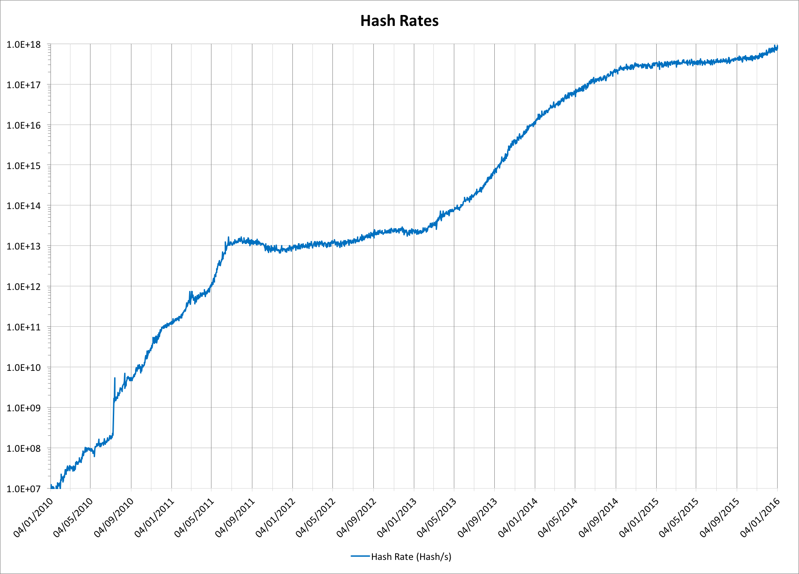
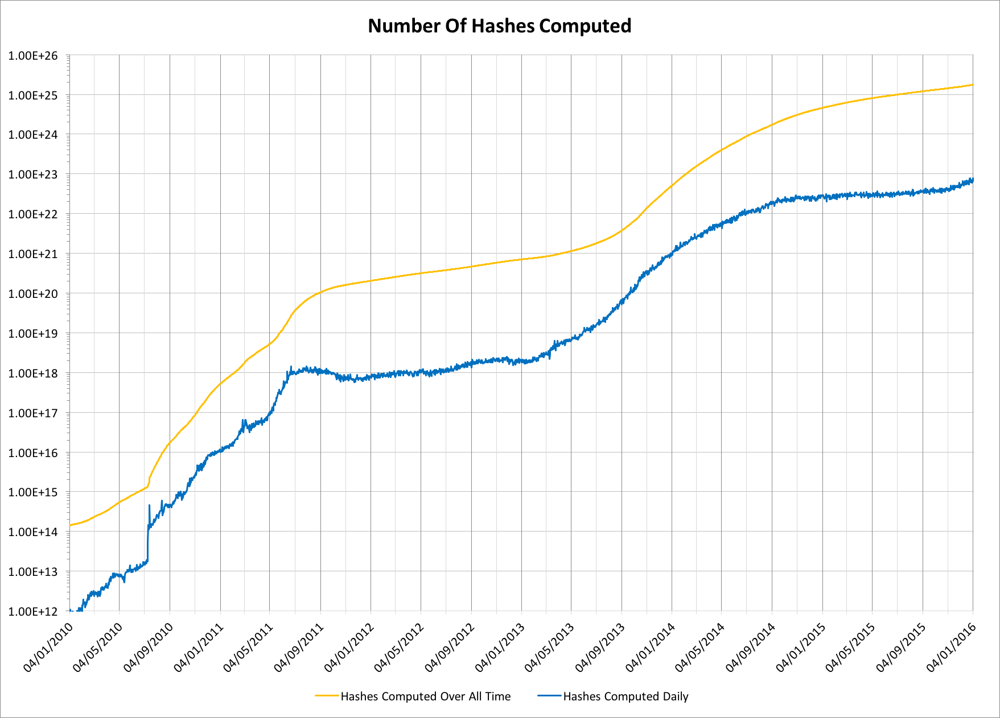

"Exahash" sounds like it could well have been the hammer of the Norse
Gods of old as it defeated all in battle. In the Bitcoin world of early
2016, however, a mining network that achieves one exahash per second
will soon become part of the new folklore. It will, as others before it,
quantitatively destroy all earlier incarnations of itself.

Common wisdom that this ever-increasing hash rate makes the Bitcoin
network continually stronger, but what does that strength mean? What is
it stronger than? What guarantees does it offer? The answer, as so
often, is perhaps less clear-cut than we might first imagine!

## The nature of Bitcoin hashing (an aside)

The Bitcoin network is secured and processes transactions by mining.
Mining comprises two activities, block making and hashing. Block making
is generally the preserve of very large miners or mining pool operators
(see ["The Gambler's Guide To Bitcoin Mining"](index.php?option=com_content&view=article&id=32:the-gamblers-guide-to-bitcoin-mining&catid=8:analysis&Itemid=110)),
while hashing is the activity that can be decentralized to many
different operators. For our purposes, though, we're not interested in
block making, but instead hashing.

Hashing is the process by which computational guesses are made in order
to solve the cryptographic puzzle required to mine a Bitcoin block. The
hashing process is the "work" in the "proof-of-work" that is often
synonymous with Bitcoin mining.

When we talk about "work" we really mean this in a thermodynamic
sense. The work involves performing a deliberately uninteresting
computational task that takes useful energy (electricity) and turns it
into less useful energy (heat). The purpose is for the hashing engines
to demonstrate their expenditure of real-world-valuable electrictiy in
the chance of obtaining Bitcoins via mining rewards.

In theory the system can be gamed by trying to find uses for the less
useful heat energy, but in practice this is only used in a very small
part of the network and generally doesn't fit well with most heat usage
patterns. Most users don't want continual heat, while Bitcoin mining
hardware depreciates in value too fast for users to afford to run it at
less than 100% utilization. Entropy is, in general, the major winner.

While not terribly environmentally friendly the design pattern does work
rather well, but there are unanswered questions about long-term
implications of proof-of-work networks. While watching the most recent
episode of Star Wars and seeing the First Order's Starkiller Base
draining all of the power from a sun I was left wondering if this was
the ultimate fate of proof-of-work!

## Hash rates

Hash rates have been incrementally on the rise for very good economic
reasons. Throughout 2015 their growth rates reflected the lower BTC:USD
valuation, but with the increase in the value of Bitcoins and the
introduction of new 16nm ASICs there has been room for yet another
period of rapid hash rate expansions.

2009 wasn't very interesting for Bitcoin mining so we take up our story
from 2010:

The chart is plotted on a logarithmic scale to make it meaningful. Each
vertical graduation is 10x larger than the one immediately below. The
late 2015 plot is apparently showing a big uptick but it remains to be
seen just how large this will actually be, but that 1 exahash per second
figure (1.0 x 10^18^ hashes per second) is quite staggering. Generally
these sorts of numbers just don't appear in normal engineering
activities. To put this in perspective, if we had every person on the
planet each make the same sorts of guesses that the hashing network does
then every one of us would need to make more than 135 million guesses
per second to match this same rate.

## What does proof-of-work actually do?

Proof-of-work is intended to secure the Bitcoin network. It does this by
making it computationally very difficult for a bad actor to change
historical transactions. They would have to generate a newer, stronger,
proof-of-work than has been done by the good actors within the system.
When we actually talk about this sort of proof, however, what's really
meant is that we believe the probability of constructing an alternative
timeline for the Bitcoin blockchain becomes sufficiently low that it's
not a practical concern. The mathematics for this are given in the
original Satoshi whitepaper.

It's generally presumed that newer work makes it incrementally less
likely that really old work could be overturned. This would certainly be
true if the network didn't get faster, but what are the actual numbers?

We can start by considering the measured hash rates since the start of
the Bitcoin network, but rather than looking at the hash rate per
second, let's look at two other numbers. Let's evaluate the total
number of hashes computed ever since the first genesis block, and the
number of hashes computed on any given day. Hash rate numbers aren't
precise, but statistically, over time, they work out pretty accurately:

Notice that both traces are plotted on the same axis!

The chart tells us something really interesting about how much faster
the network is getting over time. On, or around, 2011-08-31 the total
computed hashes hit 100 exahashes (1.0 x 10^20^ hashes). A little over 2
years later, on, or around, 2013-09-23 the number of hashes computed on
a daily basis hit the same number. Had the network of 2013-09-23 been
available before the end of August 2011 it would have been possible to
recompute an entirely new Bitcoin history (32 months of work) in a
single day!

If we look at the two traces it becomes obvious that as the network
hashing capacity undergoes significant growth that the gaps become much
smaller. If we consider the 10 zettahash (1.0 x 10^22^) level, the
cumulative date was around 2013-10-22, and the daily date was
2014-06-16. Instead of 24 months required for the 100 exahash level,
slighly less than 8 months was required for 10 zettahashes.

## A new metric

What we've just seen is something of an intellectual curiosity, but
let's consider a new metric. How long it would take the network to
recompute all of the previous history? We can do this by plotting the
ratio of the total hashes computed over all time to the hashes computed
on each day up to that point:

We see something new! During periods of extreme, rapid, expansion the
hashing capacity can accelate to a point where all earlier proofs of
work become dramatically less valuable. Steady network growth in most of
2015 culminated in the network requiring almost 12 months of computation
to recompute every block since the genesis block, but only two months
later the progression towards 1 exahash/s has seen this fall to under 9
months; the entire blockchain history is apparently less strong than 2
months ago! In the middle of the extreme expansion from the first wave
of ASICs during November 2013 the network could recompute the entire
blockchain history of 58 months in under 40 days.

Far from being a constantly strengthening network, we instead see that
the network sometimes undergoes periods in which the cumulative weight
of earlier proofs of work can become significantly less valuable, albeit
perhaps only for a few months until new work is added. The lost work is,
however, never recovered.

General threat models for the Bitcoin network consider the risks of a
51% attacker causing problems for new transactions, but as and where the
Bitcoin network is used to anchor other blockchains, the history itself
becomes valuable for other reasons, potentially in excess of the value
for Bitcoin itself. In the short term there is no obvious technology to
surplant the current ASIC roadmap, but we might have some pause for
thought about whether, environmental concerns aside, proof-of-work alone
will be sufficient to secure the long-term history of the Bitcoin
blockchain.

------------------------------------------------------------------------

## Related articles

- [Hash Rate Headaches (2014-05-20)](index.php?option=com_content&view=article&id=27:hash-rate-headaches&catid=8:analysis&Itemid=110)
- [The Gambler's Guide To Bitcoin Mining (2014-06-30)](index.php?option=com_content&view=article&id=32:the-gamblers-guide-to-bitcoin-mining&catid=8:analysis&Itemid=110)
