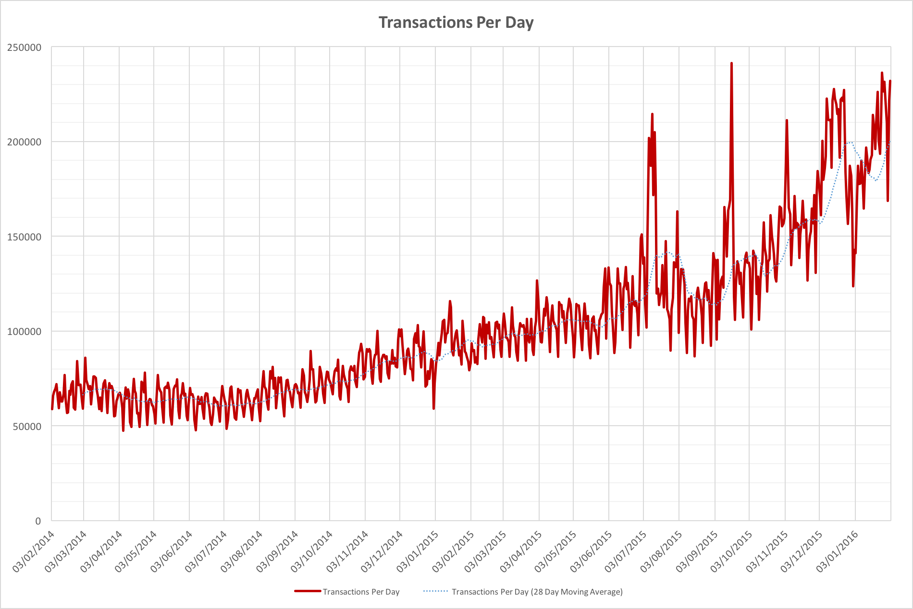

Most participants in the ongoing Bitcoin block size debates have a point
of agreement; that a shortage of block space should have an effect on
transaction fees.  Arguments aside, then, let's see what has actually
been happening.  Are fees going through the roof?  Are miners going to be
celebrating a potential offset to the block reward halving that looms in
July 2016?  The results seem a little surprising!

## Rewards for a Bitcoin miner

Bitcoin miners earn their per-block rewards in two ways.  They collect a
block reward subsidy that halves every 210,000 blocks and they collect
the fees assigned each transaction within a block.  Historically the fees
have represented a tiny fraction of the total reward.

Despite being far smaller, they are still actually worth a reasonable
amount of money per year to the block makers who collect them.  At the
time of writing they represent around \$20,000 per day, potentially
\$7.3M per year.

## An emerging fee market?

If capacity is scarce within the Bitcoin blockchain we would expect to
see transaction fees rise dramatically as users seek to ensure their
transactions are processed ahead of everyone else's, but are there any
strong indications that this has happened?

We can see that throughout 2014 the BTC-denominated average fee per
transaction steadily declined, stabilized in the first half of 2015 and
then jumped in July 2015.  Thereafter the average fee actually started to
fall again.  Transaction fees have bounced back up a little in the first
few weeks of 2016, but this doesn't appear to be the fee armageddon
that was forecast!  If anything fee levels are now back where they were
in early 2014.

The trend is certainly curious, so let's look at the transaction
volumes:

As we'd expect, the transaction volume has been steadily increasing
(otherwise there would be no block size bickering).  The last 2 months
have seen particular jumps, but that may in part be explained by the
dramatic increases in hash rates again.  Rather than a nominal 10 minute
block time we've been seeing nearer to 9 so the available capacity for
low-fee or zero-fee transactions has been higher than we'd expect.
Instead of 6 MBytes per hour we've probably had more like 6.6 MBytes
per hour of block capacity.

It's quite odd that the transaction rates have jumped quite so much in
the last 7 months though, almost doubling.  This is the very same period
in which the average per-transaction fee had jumped up.  The spike in
July gives some indication of what happened, however, as this
corresponds to the first "Bitcoin flood attack"
(see: <https://en.bitcoin.it/wiki/July_2015_flood_attack>).  The flooding
event caused the network to adjust fees upwards, but thereafter fees
steadily declined again as fee-bearing transactions saw minimal impact
on confirmation times.

The first chart we looked at considered BTC-denominated fees, but what
if we look at them in USD?

This one actually looks worse.  It appears that the fee levels have
steadily been increasing since July 2015, but we're seeing the effect
of two different things.  As the BTC-denominated fees started to fade
back, the USD price of BTC was increasing so dollar-denominated fees do
look like they've been increasing.  It's notable though that they're
still lower than they were in the first 9 months of 2014.

## Total costs per transaction

Finally, something curious: If we look at the cost of each transaction
as measured by the USD-valued total mining rewards for each day and the
numbers of transactions per day we see that things have been incredibly
stable for the last 12 months:

## Final thoughts

Far from a fee market emerging to inflate transaction costs, we don't
appear to have very much evidence of anything dramatic happening yet.
There are a number of possibilities, but one is that the transaction
volume doesn't really reflect transactions that most users care about.
Low value fees for unimportant transactions may well be leaving more
interesting transactions unaffected by any concerns about capacity.
While the block size squabbles will continue it's unclear that there
have yet been any wide-scale implications for current users of the
network.

\[Data reference: [blockchain.info](http://blockchain.info)\]
