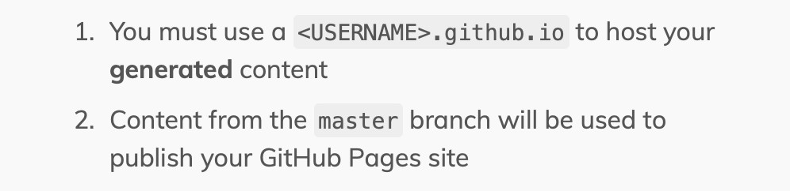
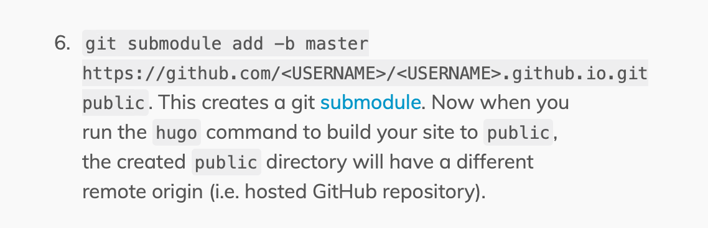

One of the more fun things about setting up this site (or at least fun for me!) is getting to have vim open
again, and being able to see how my words will properly be marked up and translated.  I guess it makes me remember
what it is to be someone who does this day in and out (organising teams of engineers is fun, but I do miss building code
sometimes).

As with all new technical challenges, I wasn't expecting that setting up a site with Hugo and GitHub pages would be
completely straightforward, but I have been remdinded that the quality of technical documentation on the web can be quite
variable.  It's amazing how quickly software engineers get used to things that must drive everyone else slightly
mad.

As GitHub doesn't have a native integration with Hugo, there's a two-repo process involved in making changes to the site.
First we have the repo with the source content, and then we have a separate one that has the rendered output from that
content.

Maybe I was a little tired, but the guidance on the
[Host on GitHub](https://gohugo.io/hosting-and-deployment/hosting-on-github/) page wasn't very clear to me:

It turns out that this was talking about the name of the Git repository that would be used to serve the site content,
so if the site is going to be `http://foo.github.io` then the repo name has to be `foo.github.io` too!

Another minor source of irritation is a general recommendation is to use Git submodules.  Many years ago I had the
misfortune to work with a codebase that included submodules and it was sufficiently traumatic for all concerned that we vowed
never to do it again.  Anyway, this time the instructions were:

This little bit of magic makes the default `public` output directory map to the repo we just discussed, which wasn't
competely obvious either.  It's worth noting that other advice online suggested a different approach in which the `public`
directory is replaced with one that has the same name as the output repo.  It's this that I ended up doing.

So far, so good, but I quickly found my submodule having a detached head, and needing this solution:
https://stackoverflow.com/questions/18770545/why-is-my-git-submodule-head-detached-from-master.  A little more Git config
editing, though, and the site was up and running.

Time to declare victory - champagne celebrations all round!
